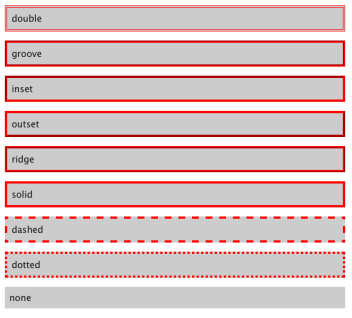
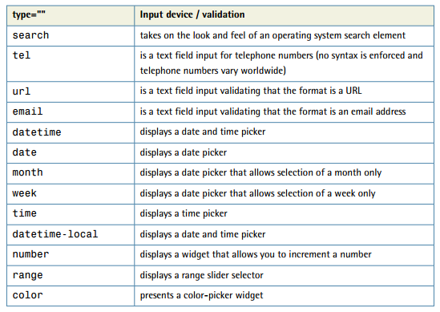
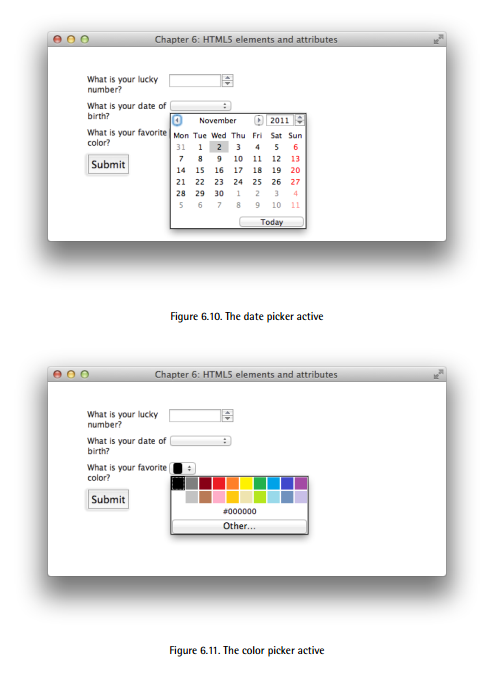

# CSS Note

Source : <strong> Rachel Andrew - The CSS3 Anthology 4th Edition - 2012 </strong>

___
___

<table id = "index" style="text-align:center;background-color:#f0f0f0;">

## INDEX

<tr>

<td><a href = "#ch1">Chapter 1</a></td>
<td><a href = "#ch2">Chapter 2</a></td>
<td><a href = "#ch3">Chapter 3</a></td>
<td><a href = "#ch4">Chapter 4</a></td>
<td><a href = "#ch5">Chapter 5</a></td>
<td><a href = "#ch6">Chapter 6</a></td>

</tr>

<tr>

<td><a href = "#ch9">Chapter 9</a></td>

</tr>

<table>

___
___

### KEYNOTES

* Inline styles have one major disadvantage: it’s impossible to reuse them. Additionally, because inline styles are located within the page’s markup, it makes the code difficult to read and maintain.
* Another approach for applying CSS styles to your web pages is to use the style element:

```html
<style>
⋮ CSS styles go in here…
</style>
```

The style tags are placed inside the head element, and while it’s nice and simple

* An external stylesheet is a file (usually given a .css filename) that contains a website’s CSS styles, keeping them separate from any one web page. Multiple pages can link to the same .css file, and any changes you make to the style definitions in that file will affect all the pages that link to it.

To link a document to an external stylesheet (say, styles.css), we simply place a link
element within the document’s head element:

```html
<link rel="stylesheet" href="style.css" />
```

___
___

<h1 id = "ch1">Chapter 1</h1>
<a href = "#index" style = "border:2px solid #0099cc; border-radius:5px; padding:5px;color:white;background-color:#0099cc;float:right;">Go to INDEX </a>

## Basic Structure

___


### CSS Syntax

A style sheet is a collection of style definitions. Every CSS style definitions has two main components:

* A list of one or more selectors, separated by commas, define the element or elements to which the style will be applied.
* The declaration block, separated by curly braces {..} , specifies what the rule atually does.

```css
h1, h2 {
font-family: "Times New Roman", Times, serif;
color: #3366cc;
}
h1, h2 {
font-family: "Times New Roman", Times, serif; color: #3366cc;
}
```

### CSS Selectors

Selectros are used to target a particular bit of markup on the page that we wish to style. This can range from targeting a particular HTML element to targeting an element which is in a particular state. The following example selects all the `h1` and `h2` elements in the page:

```css
h1, h2 {
font-family: Times, "Times New Roman", serif;
color: #3366CC;
}
```

There are many types of selectors:

#### Type Selector

It is the most basic form of selector:

```css
h1 {
font-family: Tahoma, Verdana, Arial, Helvetica, sans-serif;
font-size: 1.2em;
color: #000000;
}
```

Here we’ve set the font, size, and color for all h1 elements in the document.

#### Class Selector

It is used if we want to assign different styles to identical elements that occur in various places throughout the page. At first we assign a class to the identical elements:

```html
<h2 class = "sidebar" > This text will be white, as specified by the CSS style definition below. </h2>
```

Then, write sytle for that class:

```css
h2 {
color: #0000ff;
}
.sidebar {
color: #ffffff;
}
```

#### ID Selector

In contrast to Class selectors, ID selectors are used to style a single element:

```html
<p id="tagline">This paragraph is uniquely identified by the ID
"tagline".</p>
```

```css
#tagline {
color: #ffffff;
}
```

#### Combinators

Combinators are special characers that are placed between two simple selectors to create a selector that is more capable of targetting a precise part of the document.

##### Descendant Selector

The descendant selector mathces an element that descent from a specified element. The combinator used here is a white space.

```html
<div class="sidebar">
<h2>A heading in white</h2>
<h2>Another heading in white</h2>
</div>
```

```css
.sidebar h2 {
color: #ffffff;
}
```

##### Child Selector

Unlike Descendant selectors which match all elements that are direct or indirect descendents of a specified element, the Child selector match only the direct descendents. Combinator used here is the `>` sign:

```html
<div class="sidebar">
<p>This paragraph will be displayed in white.</p>
<p>So will this one.</p>
<div class="tagline">
<p>If we use a descendant selector, this will be white too.
But if we use a child selector, it will be blue.</p>
</div>
</div>
```

* Descendant selector `.sidebar <p>` will select all `<p>` under `.sidebar` including the `<p>` under `.tagline`.

* Child selector `.sidebar > <p>` will only select the `<p>` under `.sidebar`.

```css
p {
color: #0000FF;
}
.sidebar>p {
color: #ffffff;
}
```

##### Adjacent Selector

Adjacent selector will match all elements that are adjacent to a specified element. The combinator used here is the `+` character.

```html
<div class = 'sidebar'>
      <p> This paragraph will be red</p>
      <p> This paragraph will be red</p>
      <div class = 'tagline'>
         <p>THis paragraph will be black</p>
      </div>
   </div>
   <p>This is adjacent element</p>
   <p> This is not adjacent element</p>
```

```css
.sidebar+p {
   color: green;
}
```

##### Pseudo-class Selector

A pseudo-class selector acts as if an element has a class applied according to the state of that element. Pseudo-class selectors start with a colon and are usually added immediately after a type selector with no additional whitespace.

###### Links

```css
a:link {
color: #0000ff;
}
a:visited {
color: #ff00ff;
}
a:hover {
color: #00ccff;
}
a:active {
color: #ff0000;
}
```

* First definition sets the color of the link element when it is not visited.

* If it is visited, then the second rule is used

* If the user hovers over the link the third rule is used.

* If the link is activated then the fourth rule is used.

The `hover` and `active` classes are dynamic. **`active` class should be defined at the very last, otherwise it will overwrite the other classes.**

###### First Child

Targets the element that is the first child of a target element:

```html
<div class = 'article'>
   <p>This is First child</p>
   <p>This is Second child</p>
   <p>This is Third child</p>
   <p>This is Last child</p>
</div>
```

```css
.article p{
   font-size: 1.5em;
   font-weight: bold;
}

.article p:first-child {
   color: #0088aa;
}
```

###### Last Child

Selects the last child of a specified element:

```css
.article p:last-child {
   color: #0099cc;
}
```

###### Nth Child

The nth-child pseudo-class selector lets you select multiple elements according to their position in the document tree.

```css
tr:nth-child(odd) td {
background-color: #f0e9c5;
}
```

```css
.artice p:nth-child(2n+1) {
   color:#0099cc;
}
```

###### Only Child

The only-child pseudo-class selector will select an element if it’s the only child of its parent. For example, if I have in my markup the following two lists—the first having three list items and the second having one:

```html
<ul>
<li>Item one</li>
<li>Item two</li>
<li>Item three</li>
</ul>
<ul>
<li>A single item list - not really a list at all!</li>
</ul>
```

The CSS declaration below would only match the list item in the second list, as it matches where the li is an only child of the parent ul:

```css
li:only-child {
list-style-type: none;
}
```

##### Pseudo-element Selectors

Pseudo-elements operate as if we've added new HTML markup into your page and then styled that markup. In the CSS3 specification, `pseudo-elements` are denoted with a double colon; for example, `p::first-letter`.

###### Fisrt Letter

```css
.article p:nth-child(even)::first-letter{
   font-size: 3em;
   color:red;
}
```

It works like adding a `<span>` element to the first letter and styling the span element.

###### First Line

In the same way `first-letter` selects the first letter within a container, `first-line`
selects the first line:

```css
.wrapper:first-line {
font-size: 200%;
font-weight: bold;
}
```

It is more flexible than using `<span>` element because we do not know when the first line will end due to the variations in users window size.

###### Before

The before pseudo-element is used along with the content property to specify where generated content should be rendered. Generated content is content that’s rendered in the document from CSS.

```html
<div class="article">
<p>Hello World!</p>
</div>
```

```css
.article::before {
content: "Start here";
}
```

When viewed in a browser, this will render the words “Start here” just inside the opening `div` element—that’s before the first `p`.

###### After

Just like `before` , content is rendered after the parent element:

```css
.article::after {
content: "Start here";
}
```

#### Attribute Selectors

Attribute selectors let you target an element based on an attribute. As an example of an attribute on an HTML element, we can look at the a element, which creates a link. Attributes on the following link are href and title:

```html
<a href="http://google.com" title="Visit Google">Google</a>
<a href="http://github.com" title="Visit Github">Google</a>
```

```css
a[title="Visit Github"] {
   color:red;
}
```

___
___

<h1 id = 'ch2'>Chapter 2</h1>
<a href = "#index" style = "border:2px solid #0099cc; border-radius:5px; padding:5px;color:white;background-color:#0099cc;float:right;">Go to INDEX </a>

## Text styling and Other Basics

___

```css
p {
font-family: Verdana, Geneva, Arial, Helvetica, sans-serif;
}
```

Here, we’ve specified that if Verdana is installed on the system, it should be used; otherwise, the browser is instructed to see if Geneva is installed; failing that, the computer will look for Arial, then Helvetica. If none of these fonts are available, the browser will then use that system’s default sans-serif font.

If a font-family name contains spaces, it should be enclosed in quotation marks, like so:

```css
p {
font-family: "Courier New", "Andale Mono", monospace;
}
```

The list of fonts are often termed as "**font stack**".

### Set Font Size

We can use `font-size` property to set the font size of a text:

```css
font-size: 12px;
```

This property can take a variety of values. Their relative merits are shown in the follwoing table:

|Unit Identifier|Corresponding Units|
|---------------|-------------------|
|pt|points|
|pc|picas|
|px|pixels|
|em|ems|
|ex|exes|
|%|percentage|

* **Points and Picas**

We should avoid using Points and Picas in web design but they are excellent for print design.

```css
p {
   font-size : 10pt;
}
```

* **Pixels**

Using pixels makes it easy to achieve consistent text displays across various browsers and platforms. However, pixel measurements ignore any preferences users may have set in their own browsers; furthermore, in the case of Internet Explorer, font sizes that the designer has dictated in pixels cannot to be resized by users.

* **Ems**

Em is relative measurement. It is related to the letter 'M' as it is the widest letter.
It is relative to the user's default font size or the font size of the parent element when it's value is something other than default.

```css
p {
   font-size: .9em;
}
```

This sets the font size 10% smaller than the default font size.

```css
p {
   font-size: 1.1em;
}
```

This sets the font size 10% larger than the default font size.

* **Exes**

The ex is a relative unit measurement that corresponds to the height of the lowercase letter x in the default font size. In theory, if we set the font size of some text to 1ex, the uppercase letters will display at the height at which the lowercase letter x would have appeared if the font size had been unspecified. Furthermore, the lowercase letters will be sized relative to those uppercase letters.

* **Percentage**

As with ems and exes, font sizes that are set in percentages will honor users’ text size settings and can be resized by users:

```css
p {
font-size: 100%;
}
```

### Sizing Fonts using Keywords

* xx-small
* x-small
* small
* medium
* large
* x-large
* xx-large

These keywords are defined relative to eachother. Most browsers use `medium` as the default value of unstyled text size.

### Remove large text gap between `h1` element and the following paragraph

To remove all space between a heading and the paragraph that follows it, you must remove the bottom margin from the heading  as well as the top margin from the paragraph. To remove the top margin of the following paragraph we can use `adjacent selectors`. Adjacent selectors can be chained together to specify and element that follwos several other elements instead of just one.

```css
h1 {
font: 1.6em Verdana, Geneva, Arial, Helvetica, sans-serif;
margin-bottom: 0;
}
h1+p {
margin-top: 0;
}
```

### Spacing Between Text lines

We can use the `line-height` property to define the spacing between text lines in a paragraph:

```css
p {
   font: 1em Verdana, Geneva, Ariall, Helvatica, sans-serif;
   line-height: 2.2;
}
```

Here, the unit of measurement is not specified because the value 2.2 is a ratio. We can specify any CSS measurement units but using ratio is recomended.

### Justify Text

We can use the `text-align` property to justify text.

```css
p {
   text-align: justify;
}
```

Other values of `text-align` are:

|Value|Function|
|-----|--------|
|right|aligns the text to the right of the container|
|left|aligns the text to the left of the container|
|center|aligns the text in the center of the container|

### Indent Text

We can use `text-indent` to indent the text:

```css
p {
   text-indent: 1.5em;
}
```

It indents the first line of the paragraph.
To indent the whole paragraph we can use `padding-left` property.

### Change Text to All Capitals or Lowers

We can use the `text-transform` property to do this:

```css
p {
   text-transform; uppercase;
}
```

|Value|Function|
|:-----:|:--------:|
|uppercase|Transform whole text into capital letters|
|capitalize|Transform first letter of each word into capital|
|lowercase|Transform whole text into lower case letters|
|none|Do nothing|

### Create a drop-caps Effect

Making the first letter in a paragraph larger—a simple drop-capitals effect—is easily achieved with CSS. We can use the `first-letter` pseudo-id selector:

```css
p::first-letter {
   font-size:200%;
}
```

### Shadow Effect

We can use the `text-shadow` property to add shadow to the text:

```css
h1 {
font-size: 250%;
color: #256579;
text-shadow: 3px 3px 3px #999;
}
```

Syntax for the `text-shadow` is:

```css
text-shadow: 5px, 5px, 5px, #09c
```

The first value is the value of the horizontal distance, the second value is the value of the vertical distance, the third value is the radius of the blus effect or the measure of spread and the fourth value is the color.

### List Bullets

We can use `list-style-type` property to change or remove the bullets form the list items:

|Value|Function|
|-----|--------|
|none|Removes the bullets|
|disc|Change to disc|
|circle|Change to circle|
|decimal-leading-zero|Change to decimal number with leading zeros|
|decimal|Change to decimal numbers|
|lower roman| Change to lower roman numbers|
|upper roman| Change to upper roman numbers|
|lower alpha| Change to lower case alphabet|
|upper alpha| Change to upper case alphabets|

#### Use Image for a list-item bullet

We can use `list-style-image` property to set our bullets to images rather than `image-style-type`.

```css
ul {
list-style-image: url(bullet.gif);
}
```

#### Remove the indented left-hand margin

We can use the `padding-left` and `margin-left` property to remove the left-hand margin from the list items:

```css
ul {
list-style-type: none;
padding-left: 0;
margin-left: 0;
}
```

#### Display list horizontally

We can allign the list elements horizontally by modifying the `display` property of the `<li>` elements of the list. We can set it to `inline` to display the elements horizontally.

```css
ul.nav li {
display: inline;
}
```

### Remove default padding and margins from all elements

```css
* {
margin: 0;
padding: 0
}
```
 
 (*) is the universal selector. If the design is complex, then this is the best way to start.

### Use fonts other than those installed on user's computers

We can use fonts by loading them from the web:

``` css
@font-face {
font-family: KaffeesatzBold;
src: url(YanoneKaffeesatz-Bold.ttf);
}
h1 {
font-family: KaffeesatzBold, sans-serif;
font-weight: normal;
}
```

The `@font-face` rule declares the name of the font, then enables us to load in a font file that’s on our server with the `src` property. We can then just use this font in our font-family list as we would any other font.

___
___

<h1 id = 'ch3'>Chapter 3</h1>
<a href = "#index" style = "border:2px solid #0099cc; border-radius:5px; padding:5px;color:white;background-color:#0099cc;float:right;">Go to INDEX </a>

## Images and Other Design Elements

___

### Set Background of a Page

We can set the background image of a page by using the `background-image` property and also we can set a background color of a page by adding a `background-color` property. 

```css
body {
background-color: #333;
background-image: url(brushed_alu_dark.png);
color: #fff;
margin: 0;
padding: 0;
font: 0.75em/1.3 "Lucida Grande", "Lucida Sans Unicode",
"Lucida Sans", Verdana, Tahoma, sans-serif;
}
.wrapper {
width: 80%;
margin: 20px auto 40px auto;
background-color: #fff;
color: #333;
}
```

* By default the background image is set to `tile`.
* To prevent background from repeating we can use `background-repeat: no-repeat;`
* To repreat background along x axis: `background-repeat: repeat-x;`
* To repeat background along y axis: `background-repeat: repeat-y;`
* We can position the background image by using the `background-postion` property. It can take the following values:

  * `top left`
  * `top center`
  * `top right`
  * `center left`
  * `center center`
  * `center right`
  * `bottom left`
  * `bottom center`
  * `bottom right`

* We can use percentage values to accurately position the background image. This approach is particularly useful in a layout where other page elements are specified in percentages, so that they resize in accordance with the user’s screen resolution and dimensions. This becomes particularly important when creating responsive designs:

   ```css
   background-position: 30% 80%;
   ```

   The first of the percentages refers to the background’s horizontal position; the second dictates its vertical position. Percentages are taken from the top-left corner of the display, with 0% 0% placing the top-left corner of the image against the top-left corner of the browser window, and 100% 100% placing the bottom-right corner of the image against the bottom-right corner of the window.

* We can also use unit values to postion the background:

   ```css
   background-position: 20px 20px;
   ```

   As with percentages, the first of the specified values dictates the horizontal position, while the second dictates the vertical. But unlike percentages, the measurements directly control the position of the top-left corner of the background image.

* We can fix the background image so that it does not move when scrolling by using the `background-attachment` property.

   ```css
   background-attachment: fixed;
   ```

### Background Gradients

We can set the background of a page as gradient using `background-image: linear-gradient(top, #color1, #color2` property. we need to repeat this line using the different syntaxes expected by various browsers and the relevant vendor-specific extensions:

```css
background-image: -webkit-gradient(linear, 0% 0%, 0% 100%,
from(#000), to(#666));
background-image: -webkit-linear-gradient(top, #000, #666);
background-image: -moz-linear-gradient(top, #000, #666);
background-image: -ms-linear-gradient(top, #000, #666);
background-image: -o-linear-gradient(top, #000, #666);
background-image: linear-gradient(top, #000, #666);
```

This does not work with internet explorer 9. So, in order to create gradient background effect for IE9 we can:

* Create a gradient image and save it as 'gradient.png`.
* Combine the CSS gradients with the fallback image by loading the image first and then adding the gradients:

   ```css
   background-image: url(gradient.png);
   background-repeat: repeat-x;
   background-image: -webkit-gradient(linear, 0% 0%, 0% 100%,
   from(#000), to(#666));
   background-image: -webkit-linear-gradient(top, #000, #666);
   background-image: -moz-linear-gradient(top, #000, #666);
   background-image: -ms-linear-gradient(top, #000, #666);
   background-image: -o-linear-gradient(top, #000, #666);
   background-image: linear-gradient(top, #000, #666);
   ```

### Background Image that Scales with Browser Window

We can use the `background-size` property to scale the image to the size of the browser:

```css
html {
background-image: url(ballet-background.jpg);
background-repeat: no-repeat;
background-position: center center;
background-attachment: fixed;
-webkit-background-size: cover;
-moz-background-size: cover;
-o-background-size: cover;
background-size: cover;
color: #fff;
background-color: #000;
}
```

This technique works in current browsers, including Internet Explorer 9. Browsers failing to support the property will display the background image centered, but not scaled down or up.

### Add More than One Background Image

CSS3 support adding more than one background image. We can simply declare multiple background images and separating them using commas:

```css
.box {
height: 200px;
width: 200px;
border: 3px solid #333;
background: url(gear.png) top right no-repeat,
url(gear2.png) top left no-repeat,
url(gear3.png) bottom left no-repeat,
url(gear4.png) bottom right no-repeat;
}
```

The background is rendered from top to bottom. At first the top image is set as background and the rest of them follow sequentially.

### Make Element Transparent so that Background Shows Through

The use of opacity can add subtle effect on our design. There are two different ways to achieve this:

* **Using `opacity` property:**
   This takes value between 0 and 1, where 0 is fully transparent and 1 is fully opaque:

      ```css
      h1 {
      width: 40%;
      padding: 0.6em 0.6em 0.6em 2em;
      margin: 40px 0 0 0;
      font-size: 127.6%;
      background-color: #fff;
      color: #000;
      opacity: 0.5;
      }
      .content {
      width: 60%;
      padding: 0.6em 0.6em 0.6em 2em;
      margin: 40px 0 0 0;
      background-color: #fff;
      color: #000;
      opacity: 0.5;
      }
      ```

* **Using RGBA or HSLA:**
   We can use RGBA when specifying the `background-color` of the box. RGBA adds a fourth field which specifies the opacity of the box's background:

   ```css
   h1 {
   width: 40%;
   padding: 0.6em 0.6em 0.6em 2em;
   margin: 40px 0 0 0;
   font-size: 127.6%;
   background-color: rgba(255,255,255,0.5);
   color: #000;
   }
   .content {
   width: 60%;
   padding: 0.6em 0.6em 0.6em 2em;
   margin: 40px 0 0 0;
   background-color: rgba(255,255,255,0.5);
   color: #000;
   }
   ```

**There is a difference between the two methods.** Using `opacity` property we make the element and all it's children (including the texts) transparent, on the other hand, using RGBA, we will only make the background color of the element transparent.

### Adding Drop Down Shadow to an Element

We can use `box-shadow` to create a shadow on the main container of a layout:

```css
box-shadow: 3px 3px 10px 8px rgba(0, 0, 0, 0.4);
```

The values are as follows:

|Value|Description|
|-----|-----------|
|**Horizontal offset value**|This can be positive or negatinve value. If positive, the shadow will be on the right side of the box; a negative value positions it to the left.|
|**Vertical offset value**|This can also be positive or negative, with positive placing the shadow below the box and negative above it.|
|**Blur radius**|A low value here means the shadow will be sharper, while a higher value makes it more blurred. This value must be 0 or a psitive value; negative vlaues aren't allowed.|
|**Spread**|Positive values cause the shadow shape to spread in all directions, while negativfe vclaues cause the shadow to contract.|
|**Color**|This may be RGBA, as used in this example, or hex.

We can also add a keyword of `inset` at the beginning of the list of values, which will create an inner shadow:

```css
box-shadow: inset 3px 3px 10px 8px rgba(0, 0, 0, 0.4);
```

### Rounding Corners of an Element

To create rounded corners on an element we can use `border-radius` property. We can round different edges differently:

```css
.wrapper {
width: 80%;
margin: 20px auto 40px auto;
background-color: #fff;
color: #333;
background-image: url(brushed_alu.png);
-webkit-box-shadow: 3px 3px 10px 8px rgba(0, 0, 0, 0.4);
-moz-box-shadow: 3px 3px 10px 8px rgba(0, 0, 0, 0.4);
box-shadow: 3px 3px 10px 8px rgba(0, 0, 0, 0.4);
-webkit-border-radius: 10px;
-moz-border-radius: 10px;
border-radius: 10px;
}
```

### Rotate Image without Image Editing Software

In CSS3 there is an exciting feature called CSS Transform. It enables us to manipulate elements on the page using just CSS.
We can use `transform` property to rotate an image. This command varies for different vendors:

```css
.recipe img {
float: right;
width: 200px;
margin: 0 0 1em 1em;
-webkit-box-shadow: 3px 3px 5px 3px rgba(0, 0, 0, 0.4);
-moz-box-shadow: 3px 3px 5px 3px rgba(0, 0, 0, 0.4);
box-shadow: 3px 3px 5px 3px rgba(0, 0, 0, 0.4);
-webkit-transform: rotate(5deg);
-moz-transform: rotate(5deg);
-o-transform: rotate(5deg);
-ms-transform: rotate(5deg);
transform: rotate(5deg);
}
```

In addition to rotating, `transform` can be used to:

* scale an element, making it larger or smaller than it really is.
* "translate" and element, which is moving it along the x and y axis.
* skew an element, which skews the image and makes it slant along the x and y axis.

It’s important to note that when using transforms the rest of the content will not reflow to make room for the changed element. Therefore, when using rotate, you need to ensure that your rotated image won’t obscure any text.

### Important Notes Regarding Choosing Colors

* Set background color when using background images
* Always set both the background and the foreground color.
* Use sensible fallback colors when using RGBA as background or foreground color.
* Check color contrast
  * Background and Foreground should have a contrast ration of 4.5:1.
  * Use [Luminosity Colour Contrast Ratio Analyser](http://juicystudio.com/services/luminositycontrastratio.php) to check the contrast ratio.
* Background should only be decorative.

___
___

<h1 id = 'ch4'>Chapter 4</h1>
<a href = "#index" style = "border:2px solid #0099cc; border-radius:5px; padding:5px;color:white;background-color:#0099cc;float:right;">Go to INDEX </a>

## Navigation

___

Navigation menu is essentially a list of places to visit. We can create is using html list `<ul><li>` elements and appropriately adding CSS to it.

```html
<!DOCTYPE html>
<html>
   <head>
      <meta charset="utf-8" />
      <title>Chapter 4: List navigation</title>
      <link rel="stylesheet" href="chapter1.css" />
      120 The CSS3 Anthology
      Download from Wow! eBook <www.wowebook.com>
   </head>
   <body>
      <div class="wrapper">
         <ul class="nav">
            <li><a href="">Wine</a></li>
            <li><a href="">Fruit</a></li>
            <li><a href="">Spreads</a></li>
            <li><a href="">Biscuits</a></li>
         </ul>
      </div>
   </body>
</html>
```

CSS:

```css
.nav {
   list-style-type: none;
   margin: none;
   padding: 0;
   width: 200px;
}

.nav li {
   border-left: 10px solid rgb(144, 154, 181);
   border-bottom: 10px solid rgb(144, 154, 181);
}

.nav li a:link, .nav li a:visited {
   background-color: rgb(192, 202, 229);
   color: rgb(49, 52, 61);
   padding: 0.5em;
   display: block;
   text-decoration: none;
   border-left: 5px solid rgb(239, 213, 252);
}

.nav li:first-child {
   border-top: 10px solid rgb(144, 154, 181);
}
```

Because the link is an inline element and by default doesn’t take up the full area of the `li` —so it’s not a nice easy target to click. To make it block element we need to explicitly declare it in the CSS using the `display` property.

We can use the `hover` pseudo class selector to achieve rollover effect in navigation.

```css
.nav li a:hover {
background-color: rgb(144,154,181);
color: rgb(255,255,255);
border-left: 5px solid rgb(250,136,234);
}
```

## Subnavigation

We can create list within a list. Let's create a multilevel navigation:

```html
<!DOCTYPE html>
<html>
<head>
<meta charset="utf-8" />
<title>Chapter 4: List navigation</title>
<link rel="stylesheet" href="listnav-nested.css" />
</head>
<body>
<div class="wrapper">
<ul class="nav">
<li><a href="">Wine</a>
<ul>
<li><a href="">Red</a></li>
<li><a href="">White</a></li>
<li><a href="">Ros&eacute;</a></li>
</ul>
</li>
<li><a href="">Fruit</a></li>
<li><a href="">Spreads</a></li>
<li><a href="">Biscuits</a></li>
</ul>
</div>
</body>
</html>
```

CSS

```css
body {
background-color: #fff;
color: #000;
margin: 0;
padding: 0;
font: 0.75em/1.3 "Lucida Grande", "Lucida Sans Unicode",
"Lucida Sans", Verdana, Tahoma, sans-serif;
}
.wrapper {
width: 80%;
margin: 20px auto 40px auto;
}
.nav {
list-style: none;
margin: 0;
padding: 0;
width: 200px;
}
.nav li {
border-left: 10px solid rgb(144,154,181);
border-bottom: 1px solid rgb(144,154,181);
}
.nav li a:link,
.nav li a:visited {
background-color: rgb(192,202,229);
color: rgb(49,52,61);
padding: 0.5em;
display: block;
text-decoration: none;
border-left: 5px solid rgb(239,213,252);
}
.nav li a:hover {
background-color: rgb(144,154,181);
color: rgb(255,255,255);
border-left: 5px solid rgb(250,136,234);
}
.nav ul {
list-style: none;
margin: 0;
padding: 0;
border: 0;
}
.nav ul li {
border: 0;
}
.nav ul li a:link,
.nav ul li a:visited {
background-color: rgb(237,241,252);
color: rgb(49,52,61);
padding: 0.5em 0.5em 0.5em 1em;
display: block;
text-decoration: none;
border-left: 5px solid rgb(239,213,252);
}
.nav ul li a:hover {
background-color: rgb(255,255,255);
color: rgb(49,52,61);
border-left: 5px solid rgb(250,136,234);
}
```

* `.nav ul` selector is needed to remove the default styling of the sublist element. It is not covered by styling only the `.nav` element.
* To select the nested links we have to use `.nav ul li a` selector.

### Horizontal Menu

The HTML Code is similer to normal menu, we only have to change the CSS to make it horizontal.
There are two approaches:

* Using the `display` property:
  We can change the display of the list items from `block` to `inline-block`.

  ```css
  .nav li {
  display: inline-block;
  min-width: 8em;
  margin-right: 0.5em;
  text-align: center;
  }
  ```

* Using the `float` property:
  
  ```css
  .nav li {
   float: left;
   min-width: 8em;
   margin-right: 0.5em;
   text-align: center;
   }
   ```

### Tabbed Navigation Menu

* The HTML is similer to previous, We just need to add the `selected` class:

  ```html
   <ul class="nav">
   <li><a href="">Wine</a></li>
   <li><a href="">Fruit</a></li>
   140 The CSS3 Anthology
   <li class="selected"><a href="">Spreads</a></li>
   <li><a href="">Biscuits</a></li>
   </ul>
   ```

* Then we need to style the selected tab by using the `selected` class:

  ```css
  .nav li.selected a:link,
  .nav li.selected a:visited {
  background-color: rgb(255,255,255);
  }
  .nav li a:hover {
  background-color: rgba(255,255,255,0.8);
  }
  ```

### Additional Information in Navigation Bar

The section titles are in the same a elements as their descriptions, but also within strong elements set to display as blocks:

```html
<!DOCTYPE html>
<html>
<head>
<meta charset="utf-8" />
<title>Chapter 4: Horizontal navigation</title>
<link rel="stylesheet" href="horizontal2.css" />
</head>
<body>
<div class="wrapper">
<ul class="nav">
<li><a href=""><strong>Wine</strong>
<small>Cheese &amp; wine parties - a classic!</small>
</a></li>
<li><a href=""><strong>Fruit</strong>
<small>Grapes, apples - get your 5 a day while eating
cheese.</small>
</a></li>
<li><a href=""><strong>Spreads</strong>
<small>Pickles, chutneys, roasted garlic and more.</small>
</a></li>
<li><a href=""><strong>Biscuits</strong>
<small>Put your cheese onto Bath Ovals, digestives and water
biscuits.</small>
</a></li>
</ul>
</div>
</body>
</html>
```

CSS

```css
.nav {
list-style: none;
margin: 0;
padding: 0;
}
.nav li {
float: left;
width: 130px;
margin-right: 20px;
}
.nav li a:link strong,
.nav li a:visited strong {
font-size: 157.1%;
display: block;
font-weight: normal;
color: rgb(119,126,134);
font-style: normal;
}
.nav li a:link,
.nav li a:visited {
text-decoration: none;
color: rgb(93,78,72);
font-style: italic;
}
.nav li a:hover, .nav li a:hover strong {
color: rgb(0,0,0);
}
```

### Add Icons to Links

We can use an attrubute selector that looks for `href` attributes containing a value starting with `http:` and add background image:

```html
<!DOCTYPE html>
<html>
   <head>
      <meta charset="utf-8" />
      <title>Chapter 4: Showing external links</title>
      <link rel="stylesheet" href="external-links.css" />
   </head>
   <body>
      <div class="wrapper">
         <p>You can search for more delicious cheese recipes using
         <a href="http://google.com">Google</a> or view more recipes on
         <a href="/recipes">this site</a>.</p>
      </div>
   </body>
</html>
```

CSS

```css
a[href^="http:"] {
  padding-left: 20px;
  background-image: url("bullet.png");
  background-repeat: no-repeat;
  background-position: top left;
  background-size: 1em;
}
```

* **`href^="http:"` matches all elements with `href` starting with `http:`.**
* **`href$=".pdf"` matches all elements with `href` ending with `.pdf` extension.**

### Create A Rollover Images in Navigation

* We can achieve this moving the background image when the link is focused or not focused:

  ```css
  .intouch li.twitter a:link, .intouch li.twitter a:visited {
      background-position: 0 -30px;
   }
   .intouch li.rss a:link, .intouch li.rss a:visited {
      background-position: 0 -30px;
   }
   .intouch li.email a:link, .intouch li.email a:visited {
      background-position: 0 -60px;
   }

  .intouch li.twitter a:hover {
      background-position: 0 0px;
      color: rgb(105,210,231);
   }

   .intouch li.rss a:hover {
      background-position: 0 0px;
      color: rgb(243,134,48);
   }
   .intouch li.email a:hover {
      background-position: 0 0px;
      color: rgb(56,55,54);
   }
   ```

   Here, we first chose the `background-position` of the image somewhere out of view and then when the item is focused we repositioned the image to original location.

* We can also achieve this by using the `opacity` property. Initially we can set the `opacity` of the background image as `.5` and then when the item is focused we can change it to `1`

   ```css
   .intouch li.twitter a:link, .intouch li.twitter a:visited {
      background-position: 0 0px;
      color: rgb(105,210,231);
      opacity: 0.5;
   }
   .intouch li.rss a:link, .intouch li.rss a:visited {
      background-position: 0 0px;
      color: rgb(243,134,48);
      opacity: 0.5;
   }
   .intouch li.email a:link, .intouch li.email a:visited {
      background-position: 0 0px;
      color: rgb(56,55,54);
      opacity: 0.5;
   }
   .intouch li.twitter a:hover,
   .intouch li.rss a:hover,
   .intouch li.email a:hover {
      opacity: 1;
   }
   ```

### Create Drop Down Menu

The original drop down menus were dropped because for being inaccessible and bloated. They required JavaScript to work and if the computer did not have any JavaScript support then the menu would not be shown. More recently, developers realized that the support of the `:hover` dynamic pseudo class on elements other than links enabled us to create CSS-only dropdown menus without needing any JavaScript.

At first, we start with writing HTML for nested lists:

```html
<body>
  <div class="wrapper">
    <ul class="nav">
      <li><a href="">Home</a></li>
      <li><a href="">About us</a>
        <ul>
          <li><a href="">Directors</a></li>
          <li><a href="">History</a></li>
        </ul>
      </li>
      <li><a href="">Products</a></li>
      <li><a href="">Ordering</a>
        <ul>
          <li><a href="">Our shops</a></li>
          <li><a href="">Other stocklist</a></li>
        </ul>
      </li>
      <li><a href="">Contact us</a></li>
    </ul>
  </div>
</body>
```

The problem with CSS menus is that they can be very difficult to use. The menus are generally inaccessible for the users using only keyboard to navigate, and can be fiddly to click on when using a mouse. So, it is recomended to **create menus using CSS but use JavaScript to enhance their usability**.

Now, we use CSS to display our list as a horizontal menu:

```CSS
.nav {
  list-style: none;
  margin: 0;
  padding: 0;
  font-size: 114.3%;
}

.nav > li {
  float: left;
  width: 130px;
  margin-right: 20px;
  position: relative;
}

.nav li a:link, .nav li a:visited {
  display: block;
  text-decoration: none;
  color: rgb(122, 106, 83);
}

.nav li a:hover {
  color: rgb(153, 178, 183);
}
```

Next we will style our drop-downs:

```css
.nav ul {
  list-style-type: none;
  position: absolute;
  background-color: rgb(213, 222, 217);
  border: 5px solid rgb(153, 178, 183);

  -webkit-border-radius: 10px;
  -moz-border-radius: 10px;
  border-radius: 10px;

  padding: 0.5em;
  margin: 0.5em 0 0 0;

  -webkit-box-shadow: 2px 2px 2px 2px rgba(0, 0, 0, 0.2);
  -moz-box-shadow: 2px 2px 2px 2px rgba(0, 0, 0, 0.2);
  box-shadow: 2px 2px 2px 2px rgba(0, 0, 0, 0.2);

  font-size: 85.7%;
  width: 8em;
  line-height: 1.8;
}

.nav ul li a:link, .nav ul li a:visited {
  color: rgb(0, 0, 0);
}

.nav ul li a:hover {
  color: rgb(122, 106, 83);
}
```

Now, we hide the menus by setting the left margin on the menu `.nav ul` to a large negative value, throwing it off the side of the screed:

```css
.nav ul {
   margin: 0.5em 0 0 -9999px;
}
```

We could also set the menus to `display:none` to hide them but this can cause the browser not letting the user to navigate to the hidden items when shown.

To bring the sub menu back on the screen we will modify the `:hover` pseudo class selector for the parent `<li>` element:

```css
.nav li:hover ul {
   margin-left: 0;
}
```

There is still a small problem. When navigating to the dropdown menu we have to fast, otherwise it disappears. Moreover, while using tab to the links using the keyboard, we'll find that the browser does tab to the hidden items but because they are hidden, they stay invisible. To deal with these issues we have to add some JavaScript. We will use a jQuery plugin called [Superfish](http://users.tpg.com.au/j_birch/plugins/superfish/). This plugin simply enhances the CSS menu.

The only change required is the need to add an extra selector to the rule where we set our margin on hover:

```css
.nav li:hover ul, .nav li:sfHover ul {
   margin-left: 0;
}
```

Then we need to download [Superfish](http://users.tpg.com.au/j_birch/plugins/superfish/) and add the **superfish.js** file to our site and finally add the JavaScript to the head of our document:

```html
<head>
  <meta charset="UTF-8">
  <meta name="viewport" content="width=device-width, initial-scale=1.0">
  <meta http-equiv="X-UA-Compatible" content="ie=edge">
  <title>Drop Down Menu</title>

  <link rel="stylesheet" href="dd.css" />

  <script src="http://ajax.googleapis.com/ajax/libs/jquery/1.7.1/
  ➥jquery.min.js" type="text/javascript"></script>
  <script src="superfish.js" type="text/javascript"></script>
  <script>
    $(document).ready(function() {
      $('ul.nav').superfish({
        delay: 1000,
        animation: {opacity:'show',height:'show'},
        speed: 'fast',
        autoArrows: false,
        dropShadows: false
      });
    });
  </script>

</head>
```

___
___

<h1 id = 'ch5'>Chapter 5</h1>
<a href = "#index" style = "border:2px solid #0099cc; border-radius:5px; padding:5px;color:white;background-color:#0099cc;float:right;">Go to INDEX </a>

## Tabular Data

___

**Tabular data** is information that’s displayed in a table, and which may be logically arranged into columns and rows.

### Make Tabular Data Accessible

At first add the caption element:

```html
<caption>
Yearly Income 2008 - 2011
</caption>
```

The caption element adds a caption to the table. By default, browsers generally display the caption above the table; however, we can manually set the position of the caption in relation to the table using the `caption-side` CSS property:

```css
caption-side: bottom;
```

Using a caption instead of a heading for a table ensures that the caption is tied to the table.

The `th` element identifies data that's a row or a column heading. We use `scope` attribute to the `th` tag for identifying row or column headings:

```html
<th scope="row">Grants</th>
```

```html
<th scope="col">2011</th>
```

Before we begin styling tables, it is recomended to check the accessibility of the values. We should make a habit to keeping accessibility in mind as we design, we will find that it becomes a second nature and adds very little to a project's development time.

### Add Border to the Table

We can add borders to tables just as we did with other HTML elements.

```css
.datatable {
   border: 1px solid #338ba6
}
```

We can also add borders to individual cells:

```css
.datatable td, .datatable th {
  border: 1px solid #73c0d4
}
```

In place of `solid` there can also be:



### Remove the space between Cells after Adding Borders

We can remove the spaces between the cells by setting the value of the `border-collapse` property to `collapse`:

```css
.datatable {
   border: 1px solid #338ba6;
   border-collapse: collapse; /*remove space between cells*/
}
.datatable td, .datatable th {
   border: 1px solid #73c0d4;
}
```

### Alternate Color between Rows or Collumns

* To alternate color between rows we need to use `nth-child` pseudo class selector:

  ```css
  .datatable tr:nth-child(odd) {
      background-color: #dfe7f2;
      color: #000;
   }
   ```

* To alternate color between columns we need to use the `col` element and `colgroup` element and also use `nth-child` to alternate color between them:

  ```html
  <table class="datatable">
   <colgroup>
      <col />
      <col />
   </colgroup>
   <colgroup>
      <col />
      <col />
   </colgroup>
   <tr>
      <th>Pool A</th>
      <th>Pool B</th>
      <th>Pool C</th>
      <th>Pool D</th>
   </tr
   ```

   Here are the styles that are applied to the colgroup element rather than col:

   ```css
   .datatable colgroup: nth-child(odd) {
      background-color: #80c9ff;
      color: #000;
   }
   .datatable colgroup: nth-child(even) {
      background-color: #bfe4ff;
      color: #000;
   }
   ```

___
___

<h1 id = 'ch6'>Chapter 6</h1>
<a href = "#index" style = "border:2px solid #0099cc; border-radius:5px; padding:5px;color:white;background-color:#0099cc;float:right;">Go to INDEX </a>

## Forms and User Interfaces

___

CSS gives us plenty of options with which to style our forms; however, forms are unlike the other HTML elements that we’ve encountered so far. Form elements—for example, fields, buttons, and any other input element—are included as a “replaced element” in the spec. Replaced elements are those whose appearance is defined by an external source. In the case of form elements, this is the browser or operating system UI. Due to this, user agents can provide interface controls that best suit the environment they’re running in; for example, a browser on a phone may deal with a select list in a different way from a desktop browser. This is helpful in terms of usability, in that a user grows used to the control offered by the device they’re using; however, it can be frustrating to web designers who feel they should have more control over these interface elements.

Simple Example:

```html
<!DOCTYPE html>
<html lang="en">
<head>
  <meta charset="UTF-8">
  <meta name="viewport" content="width=device-width, initial-scale=1.0">
  <meta http-equiv="X-UA-Compatible" content="ie=edge">
  <link rel="stylesheet" href="fui.css" />
  <title>Forms and User Interface</title>
</head>
<body>
  <div class="wrapper">
    <form method="post" action="/contact" id="contact-form">
      <div>
        <label for="fName">Name</label>
        <input type="text" name="fName" id="fName" required=
        "required" />
      </div>
      <div>
        <label for="fEmail">Email address</label>
        <input type="text" name="fEmail" id="fEmail" />
      </div>
      <div>
        <label for="fQuestion">Question / Comments</label>
        <textarea name="fQuestion" id="fQuestion" rows="10"
        cols="30"></textarea>
      </div>
      <div class="submit">
        <input type="submit" name="contact-submit"
        id="contact-submit" value="Submit" />
      </div>
    </form>
  </div>
</body>
</html>
```

CSS

```css
form {
  width: 400px;
}
form div {
  float: left;
  width: 400px;
  padding: 0 0 0.75em 0;
}
form label {
  float: left;
  width: 120px;
}
form textarea, form input {
  float: right;
  width: 250px;
  border-top: 1px solid #999;
  border-right: 1px solid #ccc;
  border-bottom: 1px solid #cfcfcf;
  230 The CSS3 Anthology
  border-left: 1px solid #cfcfcf;
  -webkit-box-shadow: inset -2px 1px 2px 2px rgba(0, 0, 0, 0.1);
  -moz-box-shadow: inset -2px 1px 2px 2px rgba(0, 0, 0, 0.1);
  box-shadow: inset -2px 1px 2px 2px rgba(0, 0, 0, 0.1);
  padding: 4px;
}
form input[type="submit"] {
  float: none;
  width: auto;
  padding: 0.25em;
  -webkit-box-shadow: -2px 1px 2px 2px rgba(0, 0, 0, 0.1);
  -moz-box-shadow: -2px 1px 2px 2px rgba(0, 0, 0, 0.1);
  box-shadow: -2px 1px 2px 2px rgba(0, 0, 0, 0.1);
  font-size: 125%;
  -webkit-border-radius: 3px;
  -moz-border-radius: 3px;
  border-radius: 3px;
}
form div.submit {
  text-align: right;
}
```

### Highlight a Field When A User Tabs Into or Clicks on It

This can be achieved by using the `:focus` pseudo class selector:

```css
form input:focus, textarea:focus {
  background-color: #fbef8e;
}
```

### HTML Form Input Types




### Style Form Elements Based On Their Validity

The CSS3 Basic User Interface Module outlines several dynamic pseudo-classes that we can use to detect the various states of a field as it’s interacted with by the user:

* `:default`
* `:valid`
* `:invalid`
* `:in-range`
* `:out-of-range`
* `:required`
* `:optional`
* `:read-only`
* `:read-write`

```css
input:focus:required:invalid {
  background-color: rgb(255, 0, 0, .5);
}

input:focus:required:valid {
  background-color: rgba(96, 236, 96, 0.5);
}
```

The first slightly long-winded selector selects input elements that are focused (the user has tabbed or clicked into them), set to required, and invalid. This means that the invalid icon won’t show when the user first arrives at the form—only once they start completing an input.

The second targets any input element that’s required and valid. I’ve chosen not to set these to only show on focus. This is because it’s comforting to see the confirmation that your input is correct, so they’ll stay after the user clicks out of the field once it’s completed it correctly.

### Group Related Fields

We can group from fields logically using a `fieldset`, and then style the fieldset element to make the end result more attractive.

```html
<!DOCTYPE html>
<html lang="en">
<head>
  <meta charset="UTF-8">
  <meta name="viewport" content="width=device-width, initial-scale=1.0">
  <meta http-equiv="X-UA-Compatible" content="ie=edge">
  <link rel="stylesheet" href="fui.css" />
  <title>Forms and User Interface</title>
</head>
<body>
  <div class="wrapper">
    <form method="post" action="/contact" id="contact-form">
      <p class="help">Please complete the form to register.
          Required fields are indicated by a <em>*</em>.</p>
      <fieldset>
        <legend>Create an account</legend>
        <div>
          <label for="fName">Name <em>*</em></label>
          <input type="text" name="fName" id="fName"
          required="required" />
          </div>
          <div>
          <label for="fEmail">Email address <em>*</em></label>
          <input type="email" name="fEmail" id="fEmail"
          required="required" placeholder="name@example.com" />
          </div>
          <div>
          <label for="fPassword">Password <em>*</em></label>
          <input type="text" name="fPassword" id="fPassword"
          required="required" />
          </div>
          <div>
          <label for="fPassword2">Confirm password <em>*</em>
          </label>
          <input type="text" name="fPassword2" id="fPassword2"
          required="required" />
        </div>
      </fieldset>
      <fieldset>
        <legend>Your Address</legend>
        <div>
          <label for="fAddress1">Address Line 1 <em>*</em>
          </label>
          <input type="text" name="fAddress1" id="fAddress1"
          required="required" />
          </div>
          <div>
          <label for="fAddress2">Address Line 2</label>
          <input type="text" name="fAddress2" id="fAddress2" />
          </div>
          <div>
          <label for="fCity">Town / City <em>*</em></label>
          <input type="text" name="fCity" id="fCity"
          required="required" />
          </div>
          <div>
          <label for="fPostalCode">Zip / Post Code <em>*</em>
          </label>
          <input type="text" name="fPostalCode" id="fPostalCode"
          required="required" />
        </div>
      </fieldset>
      <div class="submit">
        <input type="submit" name="contact-submit"
        id="contact-submit" value="Submit" />
      </div>
    </form>
  </div>
</body>
</html>
```

CSS

```css
form {
  background-color: rgb(244,252,232);
  width: 500px;
  padding: 1em;
  -webkit-border-radius: 10px;
  -moz-border-radius: 10px;
  border-radius: 10px;
}
fieldset {
  background-color: rgba(126,208,214,0.3);
  border: 3px solid rgb(255,255,255);
  -webkit-border-radius: 10px;
  -moz-border-radius: 10px;
  border-radius: 10px;
  margin: 0 0 1em 0;
}
fieldset:hover {
  background-color: rgba(126,208,214,0.5);
}
legend {
  font-size: 133%;
}
form div {
  float: left;
  width: 100%;
  padding: 0 0 0.75em 0;
  position: relative;
}
form p.help {
  font-style: italic;
  padding: 0 1em 1em 1em;
}
form p.help em {
  color: red;
}
form fieldset div:first-of-type {
  padding-top: 1em;
}
form label {
  float: left;
  width: 30%;
  font-size: 116.7%;
}
form div label em {
  position: absolute;
  color: red;
  right: 0;
}
form input {
  width: 65%;
  font-size: 133%;
  border: 0;
  -webkit-border-radius: 10px;
  -moz-border-radius: 10px;
  border-radius: 10px;
  padding: 0.25em;
}
div.submit {
  float: none;
  background-color: rgba(126,208,214,0.3);
  border: 3px solid rgb(255,255,255);
  -webkit-border-radius: 10px;
  -moz-border-radius: 10px;
  border-radius: 10px;
  margin: 0 0 1em 0;
  padding: 0.5em 0 0.5em 0;
  text-align: center;
}
form input[type="submit"] {
  width: auto;
  border: 3px solid rgb(126,208,214);
  background-color: rgba(78,150,137,0.5);
  color: rgb(255,255,255);
}

form input[type="submit"]:hover {
  background-color: rgb(78,150,137);
}
```

___
___

<h1 id = 'ch9'>Chapter 6</h1>
<a href = "#index" style = "border:2px solid #0099cc; border-radius:5px; padding:5px;color:white;background-color:#0099cc;float:right;">Go to INDEX </a>

## CSS for Layout

___

### Create a Two Column Layout

Our initial page HTML

```html
<!DOCTYPE html>
<html>
  <head>
  <meta charset="utf-8" />
  <title>Chapter 9: 2 Column Layout - positioning</title>
  <link rel="stylesheet" href="tcl.css" />
  </head>
  <body>
  <div class="wrapper">
    <div class="header">
      <h1>Recipe <span>for</span> Success</h1>
    </div>
    <div class="main">
      <div class="article">
        <h1>Baked Garlic</h1>
        <p>Garlic may be known for being a little bit stinky, but
        baked it is absolutely delicious and as long as you feed
        it to all of your guests no-one will complain about the
        smell! Once baked the garlic becomes creamy and sweet
        making an ideal spread to accompany cheese.</p>
        <p>To make your own baked garlic, you will need:</p>
        <ul class="ingredients">
          <li>Whole heads of garlic</li>
          <li>Salt</li>
          <li>Olive Oil</li>
          <li>Foil</li>
        </ul>
        <h2>Instructions</h2>
        <ol>
          <li>Cut the tops and bottoms off the garlic heads with a
          sharp knife, keeping the head intact, then snip the
          tops of the cloves so you can see the garlic inside.
          </li>
          <li>In a large ovenproof dish use foil to make a 'nest'
          large enough to hold all of your garlic. If you are
          doing a lot of garlic you could put them into several
          nests.</li>
          <li>Add a few tablespoons of water to the nest then add
          the garlic heads.</li>
          <li>Pour over a tablespoon of olive oil per garlic,
          season with salt and tightly wrap up the top of the
          foil nest to seal in the garlic.</li>
          <li>Bake for 30 minutes at 200C, open the nest and baste
          the garlic in the juices, then cover and bake for
          CSS for Layout 339
          Download from Wow! eBook <www.wowebook.com>
          another 30 minutes.</li>
          <li>Enjoy!</li>
        </ol>
      </div>
      <div class="aside">
        <h2>More from this site</h2>
        <ul class="nav">
          <li><a href="">More garlic recipes</a></li>
          <li><a href="">The Recipe for Success index</a></li>
          <li><a href="">Cookery School</a></li>
        </ul>
        <div class="box">
          <h3>Did you know?</h3>
          <p>Lorem ipsum dolor sit amet, consectetur adipiscing
          elit. Pellentesque lacinia ligula eu risus egestas ut
          laoreet ipsum aliquet. Aenean laoreet, metus ut dapibus
          auctor, dui arcu pretium elit, bibendum ornare urna diam
          sed lacus. Suspendisse potenti. Cras tincidunt erat a
          enim mattis pretium ut non orci.</p>
        </div>
        <div class="box">
          <h3>Submit your recipes</h3>
          <p>Lorem ipsum dolor sit amet, consectetur adipiscing
          elit. Pellentesque lacinia ligula eu risus egestas ut
          laoreet ipsum aliquet. Aenean laoreet, metus ut dapibus
          auctor, dui arcu pretium elit, bibendum ornare urna diam
          sed lacus. </p>
          <p><a href="">Send it to us here!</a></p>
        </div>
      </div>
    </div>
  </div>
  </body>
</html>
```

Initial CSS

```css
body {
  background-color: rgb(255,255,255);
  color: rgb(59,67,68);
  margin: 0;
  padding: 0;
  font: 1em/1.4 "Lucida Grande", "Lucida Sans Unicode","Lucida Sans", Verdana, Tahoma, sans-serif;
}

h1, h2, h3 {
  margin: 0;
  padding: 0 0 1em 0;
  text-shadow: 1px 1px 2px rgba(0,0,0,0.3);
}

ul, ol, p {
  margin:0;
  padding: 0 0 1em 0;
}

h1 {
  font-size: 137.5%;
  color: rgb(241,47,93);
}

h2 {
  font-size: 125%;
  color: rgb(241,47,93);
}

h3 {
  font-size: 100%;
}

a:link, a:visited {
  color: rgba(241,47,93,0.8);
}
a:hover {
  color: rgb(241,47,93);
  text-decoration: none;
}

.nav {
  list-style-type: none;
  padding: 0;
}

.nav a:link, .nav a:visited {
  text-decoration: none;
  display: block;
  border-top: 1px solid rgb(232,243,248);
  padding: 0.5em 0 0.5em 0;
  color: rgb(66,148,182);
}
.nav a:hover {
  background-color: rgba(232,243,248,0.3);
}

.box {
  border-top: 1px solid rgb(219,230,236);
  padding: 1em 0 1em 0;
}
```

Our first task is to fix the width of the layout area and center it within the browser viewport:

```css
.wrapper {
  width: 940px;
  margin: 0 auto 0 auto;
}
```

Now we style the header:

```css
.header {
  text-align: right;
  padding: 40px 0 0 0;
  border-bottom: 8px solid rgb(59, 67, 68);
  margin-bottom: 40px;
}

.header h1 {
  font-size: 187.5%;
  border-bottom: 1px solid rgb(59,67,68);
  margin-bottom: 2px;
  padding-bottom: 10px;
  color: rgb(59,67,68);
}

.header h1 span {
  font-style: italic;
  color: rgb(241,47,93);
}
```

To arrange two columns using absolute postioning, we have at first make the container div `main` relatively positioned:

```css
.main {
   position: relative;
}
```

Now, we simply postion two columns within this container.

```css
.article {
  position: absolute;
  top: 0;
  left: 0;
  width: 540px;
}

.aside {
  width: 300px;
  position: absolute;
  top: 0;
  right: 0;
}
```

### Two Column Layout with Footer

Our simple positioned layout has a weakness, and we can discover what it is by adding a footer to the layout. As our items are positioned, they’re removed from the document flow, so the footer acts as if they’re not there at all, displaying across the content rather than below the two columns.

To allow footers that will sit below the columns we need to use `float` instead of `absolute`.

First we need to add the footer inside the wrapper:

```html
<div class="footer cf">
<p class="copy">Copyright &copy; Recipe for Success 2012</p>
<div class="vcard">
   <h3>Contact Us</h3>
   <p class="fn org">Recipe for Success</p>
   <div class="adr">
      <div class="street-address">1 The Avenue</div>
      350 The CSS3 Anthology
      <div class="Locality">Mytown</div>
      <div class="postal-code">SR4 4TT</div>
      <div class="country-name">United Kingdom</div>
      <div><a class="email" href="mailto:test@example.com">
      test@example.com</a></div>
      <div class="tel value">+44&nbsp;(0)&nbsp;1234 56789</div>
   </div>
</div>
</div>
```

Then add it's CSS:

```css
.footer {
  clear: both;
  background-color: rgb(59,67,68);
  color: rgb(255,255,255);
  padding: 20px;
  overflow:auto;
}
.footer .copy {
  float: left;
  width: 520px;
}
.footer .vcard {
  float: right;
  width: 280px;
}
.footer a:link, .footer a:visited {
  color: rgb(255,255,255);
}
```

While the `float` property takes elements out of the normal document flow and changes the way they relate to other elements, it also enables them to be cleared.

To display our columns using `float` rather than position simply involves removing the `position`, `top`, `left`, and `right` properties; instead, we use `float` set to `left` and `right`, respectively:

```css
.article {
  float: left;
  width: 540px;
}

.aside {
  float: right;
  width: 300px;
}
```

We can set the `clear` property on our `footer`:

```css
.footer {
  clear: both;
  background-color: rgb(59,67,68);
  color: rgb(255,255,255);
  padding: 20px;
  overflow:auto;
}
```

**We have to clear the container every time floats are used.** In the first container which is the wrapper we cleared it using the footer. But, in the footer we need to clear it using something else.

#### Clearing Inside Containers

We are now encountering one of the most discussed and troubling issues of layout using `float`: how to self clear a page.

* ##### Another Div
   An obvious sollution is to add another `div` at the end and set its style to `clear:both`. This will clear the container but it's an ineligant approach.
* ##### Floating Outer Container
   If we float an element or elements within a wrapping element that is itself floated, that wrapping element will then safely contain the inner floated elements, and all our floated elements will display according to plan.

   ```css
   .footer {
      clear: both;
      background-color: rgb(59,67,68);
      color: rgb(255,255,255);
      padding: 20px;

      float: left;
   }
   ```

   The main problem with floating a containing element in this manner is that, when floating an element, we need to give it an explicit width, and this may not always be preferable or possible. Even in situations where it is, declaring widths on internal elements of our pages makes them less flexible if they’re used elsewhere across the site.
* ##### Setting Overflow
   Another trick is to use `overflow` property of the container to neetly contain the floated elements.
   
   * If `overflow: auto` then a scrollbar will show if the elements inside are too long.
   * If `overflow: hidden` then the long elements will simply be hidden from view.
* ##### Clearfix Hack
   Another technique we may come across is known as the clearfix hack. It is recomended to avoid using it in our work, though, as the previous two methods suffice in most situations. There are a few versions of the clearfix hack, but they use generated content to add markup that clears the container. The example we’ve used in this case is explained on [Nicolas Gallagher’s site:](http://nicolasgallagher.com/micro-clearfix-hack/)

   ```css
   /* For modern browsers */
   .cf:before,
   .cf:after {
      content:"";
      display: table;
   }
   .cf:after {
      clear: both;
   }
   /* For IE 6/7 (trigger hasLayout) */
   .cf {
      zoom:1;
   }
   ```

   In our layout, we’d add the class `cf` to the footer, like this:

   ```html
   <div class="footer cf">
   ```

   The float would then self-clear.