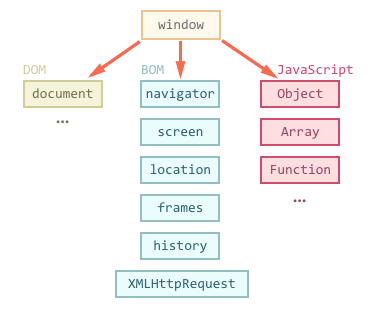

# Browser: Document, Events, Interfaces

## Document

### Browser environment, specs

- Bird's-eye view of what we have when JavaScript runs in a web-browser:
  

- There's a _root_ object called `window`. It has two roles: - First, it is a global object for JavaScript code. - Second, it represents the _browser_window_ and provides methods to control it.
- The `document` object gives access to the page's content. We can change or create anything on the page using it.
- Browser Object Model (BOM) are additional objects provided by the browser (host environment) to work with everything except the document. - The `navigator` object provides background information about the browser and the operating system. - The `location` object allows us to read the current URL and can redirect the browser to a new one.

### DOM tree

- According to Document Object Model (DOM) each HTML tag is an object. Nested tags are called _children_ of the enclosing one.
- If the browser encounters a malformed HTML, it automatically corrects it when making DOM. Errors such as missing ending tags and missing tags are auto corrected most of the time.
- Tables always have a `<tbody>` element enclosing the `<tr>` and `<td>` elements in the DOM, but in HTML it can be omitted.
- Text nodes are labelled as `#text` and comment nodes are labelled as `#comment`. They are leaf nodes and can never have children.
- There are [12 node types](https://dom.spec.whatwg.org/#node). In practice we usually work with 4 of them: - `document` - the _entry_point_ into the DOM. - element nodes - HTML tags, the tree building blocks. - text nodes - contains text. - comment node - sometimes we can put information there, it won't be shown but can be accessed by JavaScript.

### Walking the DOM

- Here's a picture of links that allow to travel between DOM nodes:
  

- `document.body` can be `null`. A script can not access an element that doesn't exist at the moment of running. In the example below the first `alert` shows `null` because `document.body` is not compiled yet.
  `html <html></html> <head> <script> alert( "From HEAD: " + document.body ); // null, there's no <body> yet </script> </head> <body> <script> alert( "From BODY: " + document.body ); // HTMLBodyElement, now it exists </script> </body> </html>`

- It the DOM world `null` means it does not exist.
- **Child nodes (or children):** elements that are direct children. For instance: `<head>` and `<body>` are children of `<html>`.
  **Descendants:** all elements that are nested in the given node including it's children.
- The `childNodes` collection provides access to all child nodes, including text nodes.
- Properties `firstChild` and `lastChild` give fast access to the first and last children.
- The parent of a node is available in `parentNode` property.
- The next node under same parent is `nextSibling` and the previous one is `previousSibling`.
- To achieve element only navigation, we need have similar properties but with the word `ELement` inside: - `children` - only those children that are element nodes. - `firstElementChild`, `lastElementChild` - first and last child elements. - `previousElementSibling`, `nextElementSibling` - neighbour elements. - `parentElement` - parent element.
- The `parentElement` property returns the _element_ parent, while `parentNode` returns _any node_ parent. They are usually the same except for `document.documentElement`:

  `js alert(document.documentElement.parentNode); // document alert(document.documentElement.parentElement); // null`

- The `<table>` element supports additionally these properties: - `table.rows` - the collection of `<tr>` elements of the table. - `table.caption/tHead/tFoot` - references to elements `<caption>`, `<thead>`, `<tfoot>`. - `table.tBodies` - the collection of `<tbody>` elements inside table.
- `<thread>`, `<tfoot>`, `<tbody>` elements provide `rows` property: - `tbody.rows` - the collection of `<tr>` inside.
- **`<tr>`:** - `tr.cells` - the collection of `<td>` and `<th>` cells inside the given `<tr>`. - `tr.sectionRowIndex` - the position (index) of the given `<tr>` inside the enclosing `<thead>/<tbody>/<tfoot>`. - `tr.rowIndex` - the number of the `<tr>` in the table as a whole (including all table rows).
- **`<td>` and `<th>`**: - `td.cellIndex` - the number of the cell inside the enclosing `<tr>`.

### Searching: `getElement*` and `querySelector*`

- If an element has an `id` attribute, then there's a global variable by the name from that `id`. We can access elements like this:
  `html <div id="elem"> <div id="elem-content">Element</div> </div> <script> alert(elem); // DOM-element with id="elem" alert(window.elem); // accessing global variable like this also works // for elem-content things are a bit more complex // that has a dash inside, so it can't be a variable name alert(window['elem-content']); // ...but accessible using square brackets [...] </script>`

- The better alternative is to use a special method called `document.getElementById(id)`.
- This method can only be called on the `document` object. It searches the whole document for that `id`.
- `elem.getElementsByTagName(tag)` looks for elements with the given tag and returns the collection of them. The parameter can also be `*` for any tags.
- `elem.getElementsByClassName(className)` returns elements that have the given CSS class. Elements may have other classes to.
- `elem.getElementsByName(name)` returns elements with the given `name` attribute.
- The call to `elem.querySelectorAll(css)` returns all elements inside `elem` matching the given CSS selector. That's the most used powerful method.

  here we, look for all `<li>` elements that are last children:

  ````html
  <ul>
    <li>The</li>
    <li>test</li>
  </ul>
  <ul>
    <li>has</li>
    <li>passed</li>
  </ul>
  <script>
    let elements = document.querySelectorAll("ul > li:last-child");

    for (let elem of elements) {
      alert(elem.innerHTML); // "test", "passed"
    }
  </script>
  ```
  ````

- We can use pseudo-classes as well. Pseudo-classes in the CSS selector like `:hover` and `:active` are also supported.

For instance, `document.querySelectorAll(':hover')` will return the collection of elements that the pointer in over now (in nesting order: from the outermost to the most nested one).

- The `elem.matches(css)` does not look for anything, it merely checks if `elem` matches the given CSS selector. It returns either `true` or `false`.

- `elem.closest(css)` looks the nearest ancestor that matches the CSS-selector. The `elem` itself can also included in the search.

  ````html
  <h1>Contents</h1>

  <div class="contents">
    <ul class="book">
      <li class="chapter">Chapter 1</li>
      <li class="chapter">Chapter 1</li>
    </ul>
  </div>

  <script>
    let chapter = document.querySelector(".chapter"); // LI

    alert(chapter.closest(".book")); // UL
    alert(chapter.closest(".contents")); // DIV

    alert(chapter.closest("h1")); // null (because h1 is not an ancestor)
  </script>
  ```
  ````

### Node Properties: type, tag and contents

- DOM nodes have different properties depending on their class. For instance, an element node corresponding to tag `<a>` has link related property and one corresponding to `input` has input related properties.
- Each DOM node belongs to a corresponding built-in class.
- The root of the hierarchy is `EventTarget`, that is inherited by `Node`, and other DOM nodes inherit from it.
  

      - The `EventTarget` is a _abstract_ class. Instance of that class can not be created. It serves as base, so that all DOM nodes support _events_.
      - Then the `Node` is also an _abstract_ class, serving as the base for DOM nodes. It provides core tree functionality such as `parentNode`, `nextSibling`, `childNodes` and so on.
      - `Element` is the base class for DOM elements. It provides element level navigations, such as: `children`, `nextElementSibling`, `firstElementChild` etc.
      - `HTMLElement` is finally the basic class for all HTML elements. It is inherited by various HTML elements:
      	- `HTMLInputElement - the class for `<input>` elements,
      	- HTMLBodyElement` - the class for `<body>` elements,
      	- `HTMLAnchorElement` - the class for `<a>` elements.
      	- ... and so on, each tag has its own class that may provide specific properties and methods.

- `elem.constructor.name` returns the came of the class to which the element belongs.
  `js alert(document.body.constructor.name); // HTMLBodyElement`
- We also can use `instanceof` to check the inheritance:
  `js alert( document.body instanceof HTMLBodyElement ); // true alert( document.body instanceof HTMLElement ); // true alert( document.body instanceof Element ); // true alert( document.body instanceof Node ); // true alert( document.body instanceof EventTarget ); // true`
- `nodeType` property provides old fashioned way to get the _type_ of a DOM node. It has a numeric value.
- Given a node, we can read it's tag name by `nodeName` or `tagName` property.
- The `innerHTML` property allows to get the HTML inside the element as a string. We can also modify it's one of the powerful ways to change a web page. - Beware: `innerHTML+=` does a full overwrite. We can append more HTML by using `elem.innerHTML+="something"`. But we should be careful in doing so, because it is not only addition but a full overwrite.
  `js elem.innerHTML += "..."; //is a shorter way to write: elem.innerHTML = elem.innerHTML + "...";`
- The `outerHTML` property contains the full HTML of the element. That is `innerHTML` plus the HTML of the element itself. - Beware: unlike `innerHTML`, it does not perform a full overwriting of the HTML, instead it replaces it as a whole in the outer context.
- The `innerHTML` property is only valid for element type nodes. The content of other nodes such as, text nodes and comment nodes, can be obtained by using `nodeValue` and `data` property.
- The `textContent` gives the text content inside the elements: only text, minus all `<tags>`. For instance:

  ````html
  <div id="news">
    <h1>Headline!</h1>
    <p>Martians attack people!</p>
  </div>

  <script>
    // Headline! Martians attack people!
    alert(news.textContent);
  </script>
  ```
  ````

- The `hidden` property of DOM nodes specify whether it is visible or not. It specifies a boolean value. Technically it works same as `style = "display:noen;"`.
- DOM elements have additional properties: - `value` - the value of `HTMLInputElement` and `HTMLSelectElement`. - `href` - the _href_ for `HTMLAnchorElement`. - `id` - the _id_ attribute for all `HTMLElement`. - ... and much more ...

### Attributes & Properties

- There are some built-in DOM properties. But technically there is no limit. We can add our own DOM property:

  ```js
  document.body.myData = {
    name: "Caesar",
    title: "Imperator"
  };

  alert(document.body.myData.title); // Imperator
  ```

  we can add methods as well

  ```js
  document.body.sayTagName = function() {
    alert(this.tagName);
  };

  document.body.sayTagName(); //BODY
  ```

- HTML standard attributes are automatically created as DOM property and can be accessed instantly.
- For HTML non standard attributes: - `elem.hasAttribute(name)` - checks for the existence. - `elem.getAttribute(name)` - gets the value. - `elem.setAttribute(name, value)` - sets the value. - `elem.removeAttribute(name)` - removes the attribute.
  Demo of working with attributes:

  ```html
  <body>
    <div id="elem" about="Elephant"></div>

    <script>
      alert(elem.getAttribute("About")); // (1) 'Elephant', reading

      elem.setAttribute("Test", 123); // (2), writing

      alert(elem.outerHTML); // (3), see it's there

      for (let attr of elem.attributes) {
        // (4) list all
        alert(`${attr.name} = ${attr.value}`);
      }
    </script>
  </body>
  ```

- The Attribute names are case insensitive.
- All the attributes, including the ones we set are visible in `outerHTML`.
- When a standard attribute changes, the corresponding property is auto-updated and vise-versa. - There are some exceptions:

  ```html
  <input />

  <script>
    let input = document.querySelector("input");

    // attribute => property
    input.setAttribute("value", "text");
    alert(input.value); // text

    // NOT property => attribute
    input.value = "newValue";
    alert(input.getAttribute("value")); // text (not updated!)
  </script>
  ```

- Attributes are strings but DOM properties may not be. For instance, the `input.checked` property is boolean.

  - There are other examples. The `style` attribute is a string, the `stype` property is an object.
  - The `href` DOM property is always the full URL, even if the attribute consists of relative URL or just a `#hash`. For example.

  ```html
  <a id="a" href="#hello">link</a>
  <script>
    // attribute
    alert(a.getAttribute("href")); // #hello

    // property
    alert(a.href); // full URL in the form http://site.com/page#hello
  </script>
  ```

- We can use non-standard attributes to pass custom data from HTML JavaScript, or to _mark_ HTML-elements for JavaScript.
- All attributes starting with _data-_ are reserved for programmers' use. They are available in the `dataset` property.
  - For instance if `elem` has a `data-about` property, then it is available as `elem.dataset.about` in DOM.
  - For multi-word attributes like `data-order-state` become camel-cased: `dataset.orderState`.

### Modifying the Document

- DOM modifications is the key to create _live_ pages.
- Creating an Element:
  There are two methods:

  - `document.createElement(tag)`- creates new element with the given tag.
  - `document.createTextNode(text)`- creates new node with given text.
  - We can assign classes to created elements:

  ```js
  let div = document.createElement("div");
  div.className = "alert alert-success";
  div.innerHTML =
    "<strong>Hi there!</strong> You've read an important message.";
  ```

- Inserting Elements:

  - `document.body.appendChild(div)` - Method that inserts a `div` inside another `div`.
  - `parentElem.appendChild(node)` - Inserts node as the last child of `parentElem`.
  - `parentElem.insertBefore(node, nextSibling)` - Inserts node under `parentElem` just before the `nextSibling` node.
  - `parentElem.replaceChild(node, oldChild)` - Replaces `oldChild` with `node` among children of `parentElem`.
  - The following set of methods provide a more flexible insertions:

    - `node.append(...nodes or string)` - append nodes or strings at the end of node.
    - `node.prepend(...nodes or string)` - prepend nodes or strings at the beginning of node.
    - `node.before(...nodes or string)` - insert nodes or string before the node.
    - `node.after(...nodes or string)` - insert nodes or string after the node.
    - `node.replaceWith(...nodes or string)` - replace node with the given nodes or string.

    A simple picture depicting what the methods do:
    

    - These methods can take more than one node as arguments.
    - These methods can only insert DOM nodes or text elements. The HTML tags wont work this way like `innerHTML`.

  - `elem.insertAdjacentHTML/Text/Element(where, html)` is a versatile method for inserting HTML/Text/Element.
    The first parameter is a string, specifying where to insert. Must be one of the following:

    - `beforebegin` - insert `html` before `elem`.
    - `beforeend` - insert `html` into `elem`, at the end.
    - `afterbegin` - insert `html` into `elem`, at the beginning.
    - `afterend` - insert `html` after `elem`.

  - `elem.cloneNode(true)` - creates a _deep_ clone of the element - with all attributes and sub-elements. If we call `elem.cloneNode(false)` then the clone is made without child elements.

  An example of copying the message:

  ```html
  <style>
    .alert {
      padding: 15px;
      border: 1px solid #d6e9c6;
      border-radius: 4px;
      color: #3c763d;
      background-color: #dff0d8;
    }
  </style>

  <div class="alert" id="div">
    <strong>Hi there!</strong> You've read an important message.
  </div>

  <script>
    let div2 = div.cloneNode(true); // clone the message
    div2.querySelector("strong").innerHTML = "Bye there!"; // change the clone

    div.after(div2); // show the clone after the existing div
  </script>
  ```

- To remove nodes, there are following methods:

  - `parentElem.removeChild(node)` - removes `elem` from `parentElem` (assuming it's a child).
  - `node.remove()`- removes the node form it's place.

- To move a node from one place to another we don't need to replace it form it's old place. **All insertion methods automatically remove the node from the old place.**

  ```html
  <div id="first">First</div>
  <div id="second">Second</div>
  <script>
    // no need to call remove
    second.after(first); // take #second and after it - insert #first
  </script>
  ```

- The call to `document.write(html)` - writes the `html` into page _right here right now_. The `html` string can be dynamically generated, so it's kind of flexible. We can use JavaScript to create a full-fledged webpage and write it. **The call to `document.write` only works while the page is loading.**. If we call it afterwards, the existing document content is erased. For instance:

  ```html
  <p>After one second the contents of this page will be replaced...</p>
  <script>
    // document.write after 1 second
    // that's after the page loaded, so it erases the existing content
    setTimeout(() => document.write("<b>...By this.</b>"), 1000);
  </script>
  ```

  So, it's kind of unusable at _after loaded_ stage. Technically when `document.write` is called while the browser is still reading the HTML, it appends directly to the HTML. That is why it is blazingly fast.

## Styles and Classes

- There are generally two ways to style an element:

  - Create a class in CSS and add it: `<div class="...">`
  - Write properties directly into `style`: `div style="..."`.

  It is preferred to use the CSS.
  We should only manipulate the `style` property if classes _can't handle it_.

- `elem.className` - corresponds to the `class` attribute of an element. If we replace this with another string, it will replace the whole string of classes.

  - If we need to remove a single class we can use `elem.classList` property. It is a special object with methods to `add/remove/toggle` classes. For instance:

    ```html
    <body class = "main page">
      <script>
        //add a class
        document.body.classList.add('article');

        alert(document.body.className); //main page article
        </script>
      </script>
    </body>
    ```

    - `elem.classList.add/remove("class")` - adds/removes the class.
    - `elem.classList.toggle("class")` - if the class exists, then removes it, otherwise adds it.
    - `elem.classList.contains("class")` - returns `true/false`, checks for the given class.

  - Besides that, the `elem.classList` is iterable. For instance:

    ```html
    <body class="main page">
      <script>
        for (let name of document.body.classList) {
          alert(name); // main, and then page
        }
      </script>
    </body>
    ```

- The property `elem.style` returns an object that corresponds to what's written in the _style_ attribute. For multi-word property the `camelCase` is used:

  ```txt
  background-color  => elem.style.backgroundColor
  z-index           => elem.style.zIndex
  border-left-width => elem.style.borderLeftWidth
  ```

- We can reset a style property as if it was not set by assigning it `null` string: `elem.style.display= ""`. If we set a property as empty string, the browser will use the CSS classes and it's build-in styles normally, as if there were no such property.
- We can rewrite the whole CSS of an element by using `style.cssText`:

  ```html
  <div id="div">Button</div>

  <script>
    // we can set special style flags like "important" here
    div.style.cssText = `color: red !important;
      background-color: yellow;
      width: 100px;
      text-align: center;
    `;

    alert(div.style.cssText);
  </script>
  ```

  - We can also use `elem.setAttribute('style', 'color:red...')`.

- **The `style` property operates only on the value of the _style_ attribute, without any CSS cascade.** So we can not see anything using `style` property if it is not written in the `style` attribute.
- To read these properties we need to use `getComputedStyle(element[,pseudo])` -

  - `element` to read the value for.
  - A pseudo-element if required, for instance `::before`. An empty string or no argument means the element itself.

  The result is an object with style properties, like `elem.style`, but now with respect to all CSS classes. For instance:

  ```html
  <head>
    <style>
      body {
        color: red;
        margin: 5px;
      }
    </style>
  </head>
  <body>
    <script>
      let computedStyle = getComputedStyle(document.body);

      // now we can read the margin and the color from it

      alert(computedStyle.marginTop); // 5px
      alert(computedStyle.color); // rgb(255, 0, 0)
    </script>
  </body>
  ```

  - This returned `style` object is read only.
  - It actually returns the resolved value of the property, not relative.
  - The properties of the pseudo-class `:visited` can not be read by this method.

### Element Size and Scrolling

There are many JavaScript properties that allow us to read information about element width, height and other geometry features. We often need them when moving or positioning elements in JavaScript, to correctly calculate coordinates.

- The `offsetParent` is the nearest ancestor that is:

  - CSS positioned (`postion` is `absolute`, `fixed` or `sticky`).
  - or `<td>`, `<th>`, `<table>`.
  - or `<body>`.

  In the most practical case we can use it to get the nearest CSS-positioned ancestor.

  - The `offsetLeft/offsetTop` provides with x/y co-ordinates relative to it's upper-left corner.

  In the example below the inner `<div>` has `<main>` as `offsetParent` and `offsetLeft/offsetTop` shifts from it's upper-left corner `(180)`.:

  ```html
  <main style="position: relative" id="main">
    <article>
      <div id="example" style="position: absolute; left: 180px; top: 180px">
        ...
      </div>
    </article>
  </main>
  <script>
    alert(example.offsetParent.id); // main
    alert(example.offsetLeft); // 180 (note: a number, not a string "180px")
    alert(example.offsetTop); // 180
  </script>
  ```

  There are several occasions when a `offsetParent` is `null`:

  - For not shown elements (`display:none;` or not in the document).
  - For `<body>` and `<html>`.
  - For elements with `postion:fixed`.

- `offsetWidth` and `offsetHeight` gives the outer width and height of the element.

  - Geometric properties can not be shown for elements that are not displayed. If an element or any ancestor of it has `display:none`, the geometric properties will be `null` or `zero`.
  - `isHidden` method returns `true` for elements that are on screen but not shown, that is they have zero sizes (like empty div).

- To measure the borders inside an element we can use `clientLeft` and `clientTop`. To be precise, they are not borders, they are relative co-ordinates of the inner side from the outer side.
- `clientWidth` and `clientHeight`- gives us the width and height of the content including the padding and without the scrollbar.
- `scrollWidth` and `scrollHeight` also account for the scrolled out part of the element while the previous two only account for the visible part:
  
- `scrollTop` and `scrollLeft` property gives the width and height of the hidden or scrolled out part of the element.
  

  - There properties can be modified unlike most of the other geometric properties.

- We should not use the `getComputedStyle()` method instead of geometric properties. Because of:

  - The CSS `width/height` depend on another property: `box-sizing`. A change in this `box-sizing` for CSS purposes may break such JavaScript.
  - The CSS `width/height` may be set to `auto`.

### Window Sizes and Scrolling

- We can use `clientWidth/clientHeight` of `document.documentElement` to get the height and width of the window.
- We can not use `scrollWidth/scrollHeight` do not work for `document.documentElement`. We can obtain the scroll height of entire document by :

  ```js
  let scrollHeight = Math.max(
    document.body.scrollHeight,
    document.documentElement.scrollHeight,
    document.body.offsetHeight,
    document.documentElement.offsetHeight,
    document.body.clientHeight,
    document.documentElement.clientHeight
  );

  alert("Full document height, with scrolled out part: " + scrollHeight);
  ```

  This is an inconsistency. There is no specific reason behind it.

- To avoid these peculiarities, we can use `window.pageXOffset/pageYOffset` to get the current scroll position. These properties are read only.
- Regular elements can be scrolled by changing `scrollTop/scrollLeft`.
- We can do the same for the page:

  - For all browsers except Chrome/Opera/Safari: modify `document.documentElement.scrollTop/Left`.
  - For Chrome/Opera/Safari: use `document.body.scrollTop/Left` instead.

- To avoid these cross-browser incompatibilities, there are other methods: `window.scrollBy(x,y)` and `window.scrollTo(pageX, pageY)`.

  - The method `scrollBy(x,y)` scroll the page relative to its current position. For instance, `scrollBy(0, 10)` scrolls the page `10px` down.
  - The method `scrollTo(x,y)` scrolls the page relative to the document top-left corner. It's like setting `scrollLeft/scrollTop`. To scroll to the beginning we can use `scrollTo(0,0)`.
  - There is another method: `elem.scrollIntoView(top)`:

    - if `top=true` (by default), then the page will scroll to make the `elem` appear on top of the window.
    - if `top=false` then the page will scroll that the `elem` appears at the bottom of the window.

- To make the document _unscrollable_ we can set `document.body.style.overflow` as `hidden`. This will freeze the page on it's current scroll.

### Coordinates

- Most JavaScript methods deal with one of two coordinate systems:

  - Relative to the window(or another viewport) top/left.
  - Relative to the document top/left.

- The method `getBoundingClientRect()` returns window coordinates for `elem` as an object with properties:

  - `top` - Y-coordinate for the top element edge,
  - `left` - X-coordinate for the left element edge,
  - `right` - X-coordinate for the right element edge,
  - `bottom` - Y-coordinate for the bottom element edge.

  Like this:
  

  - They do not take the scrolled out part of the window. They are calculated from the top-left corner of the window.
  - The coordinates can be fractions. We don't have to round them up.

- The call to `document.elementFromPoint(x, y)` returns the most nested element at window coordinates (x, y).

  - The syntax is : `let elem = document.getElementFromPoint(x, y);`.
  - For instance, the code below highlights and outputs the tag of the element that is now in the middle of the window:

    ```js
    let centerX = document.documentElement.clientWidth / 2;
    let centerY = document.documentElement.clientHeight / 2;

    let elem = document.elementFromPoint(centerX, centerY);

    elem.style.background = "red";
    alert(elem.tagName);
    ```

  - For out of window coordinates, it returns `null`.

- Document-relative coordinates start from the upper-left corner of the document, not the window.
- In CSS, window-relative coordinates correspond to `position:fixed`, while document-relative coordinates corresponds to `position:absolute` on top.

## Introduction to Events

### Introduction to Browser Events

- An _event_ is a signal that something has happened. All DOM nodes generate such signals (but events are not limited to DOM).
- Mouse events:

  - `click` - when the mouse clicks on an element (touchscreen devices generate it on tap).
  - `contextmenu` - when the mouse right-clicks on an element.
  - `mouseover`/`mouseout` - when the mouse cursor comes over/leaves an element.
  - `mosedown`/`mouseup` - when the mouse button is pressed/released over an element.
  - `mousemove` - when the mouse is moved.

- Form element events:

  - `submit` - when the visitor submits a `<form>`.
  - `focus` - when the visitor focuses on an element, e.g. on an `<input>`.

- Keyboard events:

  - `keydown` and `keyup` - when the visitor presses and then releases the button.

- Document events:

  - `DOMContentLoaded` - when the HTML is loaded and processed, DOM is fully built.

- CSS events:

  - `transitioned` - when a CSS-animation finishes.

- To react on events we can assign a _handler_ - a function that runs in case of an event.
- There are several ways to assign handlers:

  - A handler can be set in HTML with an attribute named `on<event>`.
    For instance, we can assign a `click` handler for an `input`, we can use `onclick`, like:

    ```html
    <input value="Click me" onclick="alert('Click!')" type="button" />
    ```

    Inside HTML we can not write a lot of code, it would be inconvenient. So we can create a JavaScript function and call it inside the HTML:

    ```html
    <script>
      function countRabbits() {
        for (let i = 1; i <= 3; i++) {
          alert("Rabbit number " + i);
        }
      }
    </script>

    <input type="button" onclick="countRabbits()" value="Count Rabbits" />
    ```

  - We can assign handlers using DOM property `on<event>`.
    For instance, `elem.onclick`:

    ```html
    <input id="elem" type="button" value="Click me!" />
    <script>
      elem.onclick = function() {
        alert("Thank You");
      };
    </script>
    ```

    This is same as previous one, **A handler is always set in the DOM property as a function. Assigning via HTML attribute is just a way to initialize it.**

    We can not assign more than one handler to one event e.g. `onclick`. If we assign via both the HTML attribute and DOM property, the HTML attribute will be overwritten.

    To remove handler we can do : `elem.onclick = null`.

  - The value of `this` inside a handler function is the element on which the handler was triggered.
  - There some common mistakes that are encountered while working with events:

    - The function should be assigned as `syThanks`, not `sayThanks()`. That is not to invoke the function.
      But in HTML, we do need the brackets. `<input type='button' id='button' onclick='sayThanks()'>`
    - The assignment `elem.onclick= "alert(1)"` works too for compatibility reasons but it is strongly recommended to avoid assigning strings.
    - Don't use `setAttributes` for handlers, they won't work.

      ```js
      // a click on <body> will generate errors,
      // because attributes are always strings, function becomes a string
      document.body.setAttribute("onclick", function() {
        alert(1);
      });
      ```

    - HTML attributes are not case-sensitive but DOM properties are case-sensitive.

  - The fundamental problem is assigning handlers in the aforementioned ways is that - we can't assign multiple handlers to one event. So to solve this problem special methods `addEventListener` and `removeEventListener` were introduced. They are free of such problem.
  - Syntax to add a handler

    ```js
    element.addEventListener(event, handler[, phase]);
    ```

    - `event` - event name, e.g. "click".
    - `handler` - The handler function.
    - `phase` - optional, the _phase_ for the handler to work. Usually not used.

  - To remove the handler we can use `removeEventListener`:

    ```js
    // exactly the same arguments as addEventListener
    element.removeEventListener(event, handler[, phase]);
    ```

    - To remove the handler we need to pass exactly the same function as was assigned.
      This does not work:

      ```js
      elem.addEventListener("click", () => alert("Thanks!"));
      // ....
      elem.removeEventListener("click", () => alert("Thanks!"));
      ```

    - To remove using `removeEventListener` we need to put the handler in a variable:
      The right way:

      ```js
      function handler() {
        alert("Thanks!");
      }

      input.addEventListener("click", handler);
      // ....
      input.removeEventListener("click", handler);
      ```

  - We can add multiple event handlers in the following way:

    ```html
    <input id="elem" type="button" value="Click me" />

    <script>
      function handler1() {
        alert("Thanks!");
      }

      function handler2() {
        alert("Thanks again!");
      }

      elem.onclick = () => alert("Hello");
      elem.addEventListener("click", handler1); // Thanks!
      elem.addEventListener("click", handler2); // Thanks again!
    </script>
    ```

  - For some handlers, we can only add then using `addEventListener`. For instance, the event `transitioned` (CSS animation finished) is like that.

- To properly handle an event we need more information about the event. The **Event Object** provides us with these information.

  - When an events happens, the browser creates an _event object_, puts details into it and passes it as an argument to the handler.
  - Example of getting mouse coordinates via event object:

    ```html
    <input type="button" value="Click me" id="elem" />

    <script>
      elem.onclick = function(event) {
        // show event type, element and coordinates of the click
        alert(event.type + " at " + event.currentTarget);
        alert("Coordinates: " + event.clientX + ":" + event.clientY);
      };
    </script>
    ```

  - Some properties of `event` object:

    - `event.type` - Event type: e.g.- "`click`".
    - `event.currentTarget` - Element that handled the event. That's exactly same as `this`.
    - `event.clientX / event.clientY` - Window-relative coordinates of the cursor, for mouse events.

  - The event object is also accessible via HTML attribute.

- We can assign an object as an event handler using `addEventListener`. When an event occurs, it's `handleEvent` method is called with it.

  - In other words, when `addEventListener` receives an object as the handler, it calls `object.handleEvent(event)` in case of an event.
  - We could also use a class for that:

    ```html
    <button id="elem">Click me</button>

    <script>
      class Menu {
        handleEvent(event) {
          switch (event.type) {
            case "mouseDown":
              elem.innerHTML = "Mouse button pressed";
              break;
            case "mouseUp":
              elem.innerHTML += "...and released.";
              break;
          }
        }
      }

      let menu = new Menu();
      elem.addEventListener("mouseDown", menu);
      elem.addEventListener("mouseUp", menu);
    </script>
    ```

  - The `handleEvent` method can also call other methods:

    ```html
    <button id="elem">Click me</button>

    <script>
      class Menu {
        handleEvent(event) {
          // mouseDown -> onMouseDown
          let method = "on" + event.type[0].toUpperCase() + event.type.slice(1);
          this[method](event);
        }

        onMouseDown() {
          elem.innerHTML = "Mouse button pressed";
        }

        onMouseUp() {
          elem.innerHTML += "...and released.";
        }
      }

      let menu = new Menu();
      elem.addEventListener("mouseDown", menu);
      elem.addEventListener("mouseUp", menu);
    </script>
    ```

### Bubbling and Capturing

- When an event happens on an element, it first runs the handlers on it, then on it's parent, then all the way up on other ancestors. This in known as **_bubbling_**.

  - Almost all events bubble, except `focus` and some others.

- A handler on a parent element can always get the details about where it actually happened using the `event.target` binding.

  - The most deeply nested element that caused the event is called a _target_ element, accessible as `event.target`.
  - Difference between `this` and `event.target` -

    - `this` - is the _current_ element, the one that has a currently running handler on it.
    - `event.target` - is the _target_ element which initiated the event, it doesn't change through the bubbling process.

  - For instance: If we have single handler `form.onclick`, then it can _catch_ all the clicks inside the form, no matter where the click happens. The click bubbles up to `<form>` and runs the handler.

    - `this` = `event.currentTarget` is the `<form>` element, because the handler runs on it.
    - `event.target` is the concrete element inside the form that actually was clicked.

  - We can use `event.stopPropagation()` method to stop bubbling. For instance: here, `body.onlClick` doesn't work if we click on `<button>`:

    ```html
    <body onclick="alert(`the bubbling doesn't reach here`)">
      <button onclick="event.stopPropagation()">Click me</button>
    </body>
    ```

    - `event.stopPropagation()` method only stops the current event from bubbling but the other event handlers on current element will run.
    - `event.stopImmediatePropagation()` will stop all the events on current element from propagating upwards.

  - We should not stop bubbling unless necessary

- The standard DOM Events describes 3 phases of event propagation:

  - Capturing phase - the event goes down to the element.
  - Target phase - the event reached the target element.
  - Bubbling phase - the event bubbles up from the element.

- Here's a picture of a click on `<td>` inside a table, taken from the specification:


- The capturing phase is rarely used and is invisible to us. Handler added using `on<Event>` property via HTML or `addEventListener` via JavaScript doesn't know anything about capturing, they only run on the 2nd or 3rd phases.
- To catch an event on the capturing phase, we need to set the 3rd argument of `addEventListener` as `true`. There are two possible values for that optional argument:

  - `false` - (default), then the handler is set on the bubbling phase.
  - `true` - then the handler is set on the capturing phase.

- Example:

  ```html
  <style>
    body * {
      margin: 10px;
      border: 1px solid blue;
    }
  </style>

  <form>
    FORM
    <div>
      DIV
      <p>P</p>
    </div>
  </form>

  <script>
    for (let elem of document.querySelectorAll("*")) {
      elem.addEventListener(
        "click",
        e => alert(`Capturing: ${elem.tagName}`),
        true
      );
      elem.addEventListener("click", e => alert(`Bubbling: ${elem.tagName}`));
    }
  </script>
  ```

  - If we click `<p>` then the sequence is:

    - `HTML` -> `BODY` -> `FORM` -> `DIV` -> `P` (capturing phase, the first listener) and then:
    - `P` -> `DIV` -> `FORM` -> `BODY` -> `HTML` (bubbling phase, the second listener)

  - Notice that the `P` appears twice.
  - `event.eventPhase` - tells us the number of phases the event was caught.

### Event Delegation

- Capturing and bubbling allows us to implement one of the most powerful event handling patterns called _event delegation_.
- The basic idea is that instead of assigning the same handler to a lot of events, we can assign a single handler on their common ancestor. In the handler we have `event.target` which points to element where the event happened.
- There might still be elements inside our preferred `event.target` element, so to make sure that our handler take such `event.target` and find out whether the event happened on it or inside it we should use `closest()` method.

  - `elem.closest(selector)` - returns the nearest ancestor that matches the selector.
  - `event.target.closest('td');` - returns `<td>` even if the click was on another element inside the `<td>`.

- We can use a single handler as entry point for many different things:

  - For instance we want to make a menu with buttons "Save", "Load", "Search" and so on. There is an object with methods `save`, `load`, `search`, ....
  - We can do this by adding a handler for the whole menu and `data-action` attributes for buttons that has the method to call:

    ```html
    <button data-action="save">Click to Save</button>
    ```

    The handler reads the attribute and executes the method. Working example:

    ```html
    <div id="menu">
      <button data-action="save">Save</button>
      <button data-action="load">Load</button>
      <button data-action="search">Search</button>
    </div>

    <script>
      class Menu {
        constructor(elem) {
          this._elem = elem;
          elem.onclick = this.onClick.bind(this); // (*)
        }

        save() {
          alert("saving");
        }

        load() {
          alert("loading");
        }

        search() {
          alert("searching");
        }

        onClick(event) {
          let action = event.target.dataset.action;
          if (action) {
            this[action]();
          }
        }
      }

      new Menu(menu);
    </script>
    ```

- We can use event delegation to add _behaviors_ to elements declaratively, with special attributes and classes.

  - The pattern has two parts:

    - We add a special attribute to an element.
    - A document-wide handler tracks events, and if an event happens on an attributed element - performs the action.

- For instance, here the attribute `data-counter` adds a behavior: "increase on click" to buttons:

  ```html
  Counter: <input type="button" value="1" data-counter /> One more counter:
  <input type="button" value="2" data-counter />

  <script>
    document.addEventListener("click", function(event) {
      if (event.target.dataset.counter != undefined) {
        // if the attribute exists...
        event.target.value++;
      }
    });
  </script>
  ```

- One more example: a click on an element with attribute `data-toggle-id` will show/hide the element with the given `id`:

  ```html
  <button data-toggle-id="subscribe-mail">
    Show the subscription form
    <button>
      <form id="subscribe-mail" hidden>Your mail: <input type="email" /></form>

      <script>
        document.addEventListener('click', function(event) {
          let id = event.target.dataset.toggleId;
          if(!id) return;

          let elem - document.getElementById(id);

          elem.hidden = !elem.hidden;
        });
      </script>
    </button>
  </button>
  ```

### Browser Default Actions

- Many events automatically lead to browser actions. Such as:

  - A click on a link - initiates going to it's URL.
  - A click on submit button inside a form - initiates it's submission to the server.
  - Pressing a mouse and moving it over text automatically select the text.

  If we handle an event in JavaScript, often we don't want browser actions. Fortunately, it can be prevented.

- There are two ways of preventing browser actions:

  - The main way is to use the `event` object. There's a method `event.preventDefault()`.
  - If the handler is assigned using `on<event>`, then we can just `return false` form it.

    ```html
    <a href="/" onclick="return false">Click here</a> or
    <a href="/" onclick="event.preventDefault()">here</a>
    ```

    the previous links will not go to a new URL.

    - The return value of an event handler is usually ignored except for this instance where we return false form an event handler which was defines by `on<event>` attribute.

- Certain events can flow one into another. If we prevent the first event, there will be no second.

  - For example the `mousedown` event on an `<input>` field leads to _focusing_ on and `focus` event. If we prevent `mousedown` event, then the `focus` will will automatically be cancelled.

    ```html
    <input value="Focus works" onfocus="this.value=''" />
    <input
      onmousedown="return false"
      onfocus="this.value=''"
      value="Click me"
    />
    ```

- The property `event.defaultPrevented` is `true` if the default action was prevented, and `false` otherwise.

  - Sometimes we can use `event.preventDefault` instead of `event.stopPropagation()`.
  - For example, by default the browser on `contextmenu` event (right mouse click) shows a context menu with standard options. We can prevent it and show our own, like this:

    ```html
    <button>Righ-click for browser context menu</button>

    <button oncontextmenu="alert('Draw our menu'); return false;">
      Right-click for our context menu.
    </button>
    ```

    Now. let's say we want to implement our own document-wide context menu, with our options. And inside the document we may have other elements with their own context menus:

    ```html
    <p>Right-click here for the document context menu</p>
    <button id="elem">Right-click here for the button context menu</button>

    <script>
      elem.oncontextmenu = function(event) {
        event.preventDefault();
        alert("Button context menu");
      };

      document.oncontextmenu = function(event) {
        event.preventDefault();
        alert("Document context menu");
      };
    </script>
    ```

    The problem is that when we click on `elem`, we got two menus: the button-level and (the event bubbles up) the document-level menu. To stop this bubbling, we can use `event.stopPropagation()`:

    ```html
    <p>Right-click for the document menu</p>
    <button id="elem">
      Right-click for the button menu (fixed with event.stopPropagation)
    </button>

    <script>
      elem.oncontextmenu = function(event) {
        event.preventDefault();
        event.stopPropagation();
        alert("Button context menu");
      };

      document.oncontextmenu = function(event) {
        event.preventDefault();
        alert("Document context menu");
      };
    </script>
    ```

    The problem is that, we forever deny access to information about right-clicks for any outer code, including counters that gathers statistics and so on.

    **That is why, we need the `event.defaultPrevented` property.**

    ```html
    <p>Right-click for the document menu (fixed with event.defaultPrevented)</p>
    <button id="elem">Right-click for the button menu</button>

    <script>
      elem.oncontextmenu = function(event) {
        event.preventDefault();
        alert("Button context menu");
      };

      document.oncontextmenu = function(event) {
        if (event.defaultPrevented) return;

        event.preventDefault();
        alert("Document context menu");
      };
    </script>
    ```

### Dispatching Custom Events

- We can not only assign handlers, but also generate events form JavaScript.
- Events form a hierarchy, just like DOM element classes. The root is the `Event` class. We can create an `Event` object like this:

  ```js
  let event = new Event(event type[, options]);
  ```

  Arguments:

  - _event type_ - may be any string, like "`click`" or our own like "`hey-ho!".
  - _options_ - the object with two optional properties:

    - `bubbles: true/flase` - if `true`, then the event bubbles.
    - `cancelable: true/false` - if `true`, then the "default action" may be prevented.

    By default both are false.

- After an event has been created, we can run it on an object by calling `elem.dispatchEvent(event)`.

  - The handler reacts on it as if it were a regualar event. If the event was created with `bubbles` flag then, it bubbles.
  - In the example below the `click` event is initiated in JavaScript. The handler works same way as if the button was clicked.

    ```html
    <button id="elem" onclick="alert('Click!');">Autoclick</button>

    <script>
      let event = new Event("click");
      elem.dispatchEvent(event);
    </script>
    ```

- We can use `event.isTrusted` to tell a _real_ user event from a script generated one.
- We should use `addEventListener()` for our custom events, because `on<Event>` only works for built in events.
- The following example shows what happens when `bubbles` is `true`.

  ```html
  <h1 id="elem">Hello from the script!</h1>

  <script>
    // catch on document...
    document.addEventListener("hello", function(event) {
      // (1)
      alert("Hello from " + event.target.tagName); // Hello from H1
    });

    // ...dispatch on elem!
    let event = new Event("hello", { bubbles: true }); // (2)
    elem.dispatchEvent(event);
  </script>
  ```

- We can use UI Events instead of using `Event` class, because the right constructor allows to specify standard properties for that type of event. Like `clientX/clientY` will only work for a mouse event:

  ```js
  let event = new MouseEvent("click", {
    bubbles: true,
    cancelable: true,
    clientX: 100,
    clientY: 100
  });

  alert(event.clientX); // 100
  ```

  The generic `Event` constructor does not allow that,

  ```js
  let event = new Event("click", {
    bubbles: true, // only bubbles and cancelable
    cancelable: true, // work in the Event constructor
    clientX: 100,
    clientY: 100
  });

  alert(event.clientX); // undefined, the unknown property is ignored!
  ```

- A list of classes for UI Events form the UI Event specification:

  - `UIEvent`
  - `FocusEvent`
  - `MouseEvent`
  - `WheelEvent`
  - `KeyboardEvent`

- For our own custom event, we should use `new CustomEvent`. Technically `CustomEvent` is the same as `Event` with one exception.

  - In the second argument (object) we can add an additional property `detail` for any custom information that we want to pass with the event.

    ```html
    <h1 id="elem">Hello for John!</h1>

    <script>
      // additional details come with the event to the handler
      elem.addEventListener("hello", function(event) {
        alert(event.detail.name);
      });

      elem.dispatchEvent(new CustomEvent("hello", {
        detail: { name: "John" }
      });
    </script>
    ```

  - The `detail` property can have any data.

- We can call `event.preventDefault()` on a script-generated event if `cancelable:true` flag is specified. Applying this we can check in the handler if the event was cancelled or not:

  ```html
  <pre id="rabbit">
    |\   /|
    \|_|/
    /. .\
    =\_Y_/=
    {>o<}
  </pre>

  <script>
    // hide() will be called automatically in 2 seconds
    function hide() {
      let event = new CustomEvent("hide", {
        cancelable: true // without that flag preventDefault doesn't work
      });
      if (!rabbit.dispatchEvent(event)) {
        alert("the action was prevented by a handler");
      } else {
        rabbit.hidden = true;
      }
    }

    rabbit.addEventListener("hide", function(event) {
      if (confirm("Call preventDefault?")) {
        event.preventDefault();
      }
    });

    // hide in 2 seconds
    setTimeout(hide, 2000);
  </script>
  ```

- Usually events are processed asynchronously. That is: if the browser is processing `onclick` and in the process a new event occurs, then it waits till the `onclick` processing is finished.

  - The exception is when one event is initiated form within another one. Then the control jumps to the nested event handler, and after it goes back.
  - For instance, here is a nested `menu-open` event is processed synchronously, during the `onclick`:

    ```html
    <button id="menu">Menu (click me)</button>

    <script>
      // 1 -> nested -> 2
      menu.onclick = function() {
        alert(1);

        // alert("nested")
        menu.dispatchEvent(
          new CustomEvent("menu-open", {
            bubbles: true
          })
        );

        alert(2);
      };

      document.addEventListener("menu-open", () => alert("nested"));
    </script>
    ```

    - If we want to make it asynchronous, we can put the `dispatchEvent` at the end of `onclick` or, if inconvenient, wrap it in `setTimeout(...,0)`:

      ```html
      <button id="menu">Menu (click me)</button>

      <script>
        // 1 -> 2 -> nested
        menu.onclick = function() {
          alert(1);

          // alert(2)
          setTimeout(
            () =>
              menu.dispatchEvent(
                new CustomEvent("menu-open", {
                  bubbles: true
                })
              ),
            0
          );

          alert(2);
        };

        document.addEventListener("menu-open", () => alert("nested"));
      </script>
      ```
